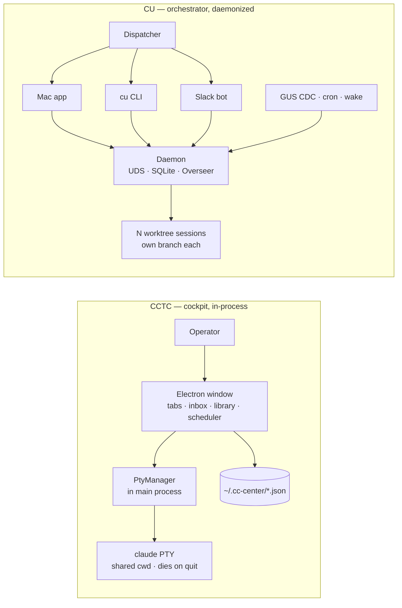

# Claude Unleashed (CU) vs. Command Center (CCTC) — Feature Analysis & Roadmap

> Deep analysis 2026-06-12, by an architect + 3 research engineers (parallel agents).
> **CU** = [`cc-oms/claude-unleashed`](https://git.soma.salesforce.com/cc-oms/claude-unleashed) @ `main`,
> v1.4.2 shipped / v1.5.0 in flight. **CCTC** = this repo (Claude Code Terminal Center), v0.4.0.
> Sources: CU README / CLAUDE.md / CHANGELOG / STATUS + 12 wiki pages + agent/workflow YAMLs;
> CCTC inventory is file:line-grounded against `src/`. Companion to
> [`superset-comparison.md`](./superset-comparison.md).

---

## TL;DR — these are different *kinds* of product

| | **CCTC (ours)** | **CU (claude-unleashed)** |
|---|---|---|
| **Thesis** | A **cockpit you sit in** — drive Claude Code sessions across projects from one window, with rich human-facing surfaces (inbox, library, scheduler, live status). | An **autonomous-agent orchestration platform** — launch and *supervise* fleets of Claude workers as background jobs from Mac app / CLI / Slack. |
| **Human role** | Operator at the keyboard, watching live terminals. | Dispatcher who delegates and reviews; the system runs unattended. |
| **Runtime** | In-process Electron main (`PtyManager`); dies on app quit. | Long-running **Node daemon** (Unix socket) + SQLite; survives app/restart, launchd-kept. |
| **Isolation unit** | Terminal tab per project, **shared cwd**. | **Git worktree per session** (own branch), or serialized branch mode. |
| **Agent model** | 4 hardcoded profiles (`shell`/`claude`/`claude-resume`/`claude-yolo`). | **YAML agents/profiles/groups/workflows** — behavior is data, not code. |
| **Parallelism** | Multiple tabs, but they collide in one cwd. | True parallel fan-out (swarms, multi-session fleets, agent groups). |
| **Supervision** | Live per-tab status (idle/working/blocked). | **Overseer** control plane: auto-extend turns, auto-resolve approvals, auto-unstick. |
| **Triggers** | In-process cron scheduler (fires only while app open). | Daemon cron **+ GUS CDC Pub/Sub events + Slack chat + wake-on-schedule**. |
| **Control surfaces** | The desktop window. | Mac app **+ `cu` CLI + Slack bot** (first-response-wins across all three). |
| **Scale** | ~118 files, 1 package + extension-sdk, single dev. | Monorepo: daemon + CLI + Mac app (SwiftUI) + MCP servers + e2e; 1459+ tests; phase-driven. |

**The one-sentence framing:** CCTC is **depth on the interactive single-operator experience**; CU is **breadth on autonomous multi-agent orchestration and Salesforce-native triggers**. They overlap on ~30% (scheduling, MCP, Claude launch, Slack-ish notifications) and diverge sharply on the rest.

---

## 1. What we BOTH have (convergent ground)

These exist on both sides — but note the depth difference.

| Capability | CCTC | CU | Edge |
|---|---|---|---|
| **Launch Claude Code sessions** | `resolveLaunch` precedence chain (`pty.ts:497`): profile → global args → project settings → extraArgs; MCP inject; Stop/Notification hooks. | `cu run` → daemon spawns worker in worktree; profile+agent merge (agent wins on conflict). | **Tie** — ours is deeper *per-launch* (hook injection, MCP URL baking); theirs is deeper *per-fleet*. |
| **Scheduling** | In-process `setTimeout` cron (`scheduler.ts`), run-history ring buffer, auto-close-on-finish, overlap-skip, silent/quiet/loud inbox levels. | Daemon cron in SQLite, survives restart, circuit-breaker after 3 boot errors, `--require-human`, `run-now` dry-run, **wake-on-schedule** (pmset). | **CU** — survives restart + wake-the-Mac; ours dies on app close. |
| **MCP** | We're an MCP **host**: local http server exposes `inbox_push` + `schedule_report` to our agents; per-project `.mcp.json` sync. | Workers inherit MCP config via profile `mcpConfig`; daemon exposes its action surface as MCP tools (`mcp-supervisor`) so *other* Claudes can drive CU. | **Different roles** — we feed tools *to* our sessions; they expose CU *as* a tool. |
| **Agent→human async channel** | **Inbox** (docs + comments, notification levels, PDF export). | Slack thread-per-session + Command Center alerts + post-mortem reports. | **Tie, different shape** — ours is a structured durable surface; theirs is conversational + post-hoc. |
| **Notifications / status** | Live per-tab `idle`/`working`/`blocked` via OSC title + Notification hook. | Overseer alert routing; session `running:active/idle/awaiting-input` (`lastEventAt`). | **Tie** — ours is finer-grained live; theirs is fleet-rollup. |
| **Skills / plugins** | Skills store (user/plugin/project scope), skill bundles, installer. | Same 3-source skill discovery + marketplaces + `recommendedSkills`/`allowedSkills` on agents. | **Tie** — same Claude Code skill model underneath. |

---

## 2. What WE have that CU doesn't (our moats — protect these)

These are genuinely distinctive to CCTC. CU is agent-agnostic-headless; we are operator-facing-rich.

1. **The interactive cockpit itself.** CU has no live terminal you type into — it's launch-and-watch. We are a real multi-tab xterm workspace with **session restore** (`sessionRestore.ts`), **tab auto-rename from OSC title**, command palette, fuzzy quick-open. This is the whole product for an operator who wants to *be in the loop*.

2. **In-app code surfaces** — Monaco/`monaco-vscode` workbench (`WorkbenchView`/`ExplorerView`), **diff viewer** (`DiffViewer`), **preview pane** with webview + MRU URLs, **mermaid rendering**. CU sends you to your own editor; we embed one.

3. **Document Library + Saved Reports** — dual-scope (global + git-trackable project) artifact store with manifest reconciliation, multi-format preview (md/pdf/image/code), frozen inbox snapshots. CU has post-mortems but no curated artifact library.

4. **Runtime extension SDK with a security model** — `@cctc/extension-sdk` + out-of-process `utilityProcess` host, **permission broker** (deny-by-default exec/fs/fetch against manifest scopes), **consent flow** (new/widened), **Node-builtin denylist + ESM/CJS guard** so untrusted code can't bypass the broker. This is a genuine third-party-extensibility platform; CU's extensibility is YAML-config, not sandboxed code.

5. **Inbox as a first-class Linear-style surface** — structured docs/comments with live (non-snapshotted) file pointers, silent/quiet/loud per-schedule levels baked at spawn, PDF export. A purpose-built async review queue.

6. **Local-only simplicity** — no daemon, no SQLite, no cloud, no launchd. `~/.cc-center/*.json` + JSONL, atomic tmp+rename. Trivially inspectable, git-trackable, zero background footprint. (A real advantage *and* the root of our biggest gaps — see §3.)

---

## 3. What CU has that we DON'T (the gap list)

Ordered roughly by strategic value. Each notes **cost to close** honestly.

### Tier 1 — big conceptual gaps

**3.1 Git-worktree-per-session isolation.** CU's substrate: every session runs on its own `claude-unleashed/<id>` branch in `~/.claude-unleashed/worktrees/`, so N parallel agents never collide and your working copy is untouched. We run every tab in the project's **shared cwd** — two Claude tabs in one project step on each other. *This is the single highest-value structural idea to borrow*, and it's the prerequisite for any real parallelism. **Cost: high** — the create/adopt/rollback saga + cleanup + likely forces a persistent process (worktrees must outlive a window). (Same conclusion as the Superset analysis.)

**3.2 Agent/profile/workflow as DATA, not code.** CU's core extensibility: an **agent** YAML (`systemPrompt`, `archetype`, `model` alias, `permissionMode`, `allowedTools`/`disallowedTools` as *claude-enforced hard walls*, `maxTurns`/`maxUsdCost`, `outputs` contract, `recommendedSkills`). A **profile** binds launch shape. An **agent-group** bundles agents under one name with a **coordinator** member. A **workflow** is a DAG of agent nodes wired by `$nodes.<id>.<key>` placeholders. Adding a new agent/persona is a file, no code. We have a **4-value hardcoded `LaunchProfileId` union**. **Cost: medium** — this is exactly our parked **Personas** work ([docs/ROADMAP.md](./ROADMAP.md)); CU's agent YAML is the reference schema to copy.

**3.3 The Overseer (autonomy control plane).** A daemon supervisor that watches every session and: (1) routes/coalesces alerts, (2) **auto-extends turn caps when there's genuine progress** (new commits/file changes → +50, max 3, ceiling +150) but starves a spinning read-Grep loop, (3) **auto-resolves approvals** via a cascade, (4) **auto-unsticks** stalled workers. We have live status *display* but no actor that *intervenes*. **Cost: high** — needs a persistent supervisor loop + progress heuristics; only meaningful once sessions run unattended.

### Tier 2 — automation & trigger surface

**3.4 GUS CDC event triggers.** Bind a Salesforce Change-Data-Capture event (bug created, story → Triaged) to a CU launch via live **Pub/Sub** off the local `sf` CLI, SOQL-enriched, per-field scoped as the cost boundary, replay-id dedup. Given we already ship a **GUS extension** (`extensions/gus`, spawns `sf`), this is unusually within reach for us. **Cost: medium** — we have the `sf` plumbing; we'd add a Pub/Sub listener + a "trigger → launch" binding. High Salesforce-org value.

**3.5 Three control surfaces with first-response-wins.** CU is drivable from Mac app **+ `cu` CLI + Slack bot**, and resolving an approval in one auto-resolves the others. We have only the window. **Cost: medium per surface** — a CLI over our stores is the cheapest; Slack is heavier.

**3.6 Approvals + permission cascade.** Risky tool calls pause the worker; a **deny→allow→LLM-judge** cascade resolves before paging a human; an **agent-scoped permission cache** remembers grants across sessions (with a "prompts spared" hit counter). We pass through Claude's own permission prompts live and don't persist grants. **Cost: medium** — only valuable in an unattended/background model.

**3.7 Wake-on-schedule.** A `pmset`-armed root helper wakes a sleeping Mac for scheduled runs. Our scheduler doesn't even survive app close, let alone sleep. **Cost: low-medium** if we first get a persistent scheduler; meaningless without one.

### Tier 3 — orchestration depth

**3.8 Swarms** — reusable, parameterized, *deterministic* `forEach`/`when` fan-out blocks, compile-validated (topology + Workflow-tool probe) before any worker spawns. **3.9 Multi-session fleet control** — `sessions ls`/`watch`, `ask-all`/`pause-all`/`resume-all` (SIGSTOP/SIGCONT), `continue`/`resume`/`unstick`/`hint`/`extend`. **3.10 Post-mortems** — auto-generated per terminal session (files changed, commits, anomalies). **3.11 Shipped recipes** — installable bundles (`gus-to-pr`, `slack-concierge`, `core-ftest-author`, `audit-fix-feature`…) packaging agents+groups+workflows+triggers with `${variable}` detection. **Cost: high, and all downstream of 3.1+3.2** — no point until we have isolation + data-driven agents.

### Tier 4 — Salesforce-infra-specific (probably out of scope for us)

**3.12 Salesforce Workspaces (`sfworkctl`)** — lease/warm/release **remote Core devcontainers** as a pool and run sessions against a live JVM. Deeply SF-infra-specific; **likely not worth replicating** unless we target Core engineers specifically.

---

## 4. Recommendations — what we *should* add (and what to skip)

Sequenced smallest-cost-first, respecting our local-only identity. The throughline: **CU earns its complexity by being unattended; we should adopt CU ideas only as far as they serve an operator-in-the-loop, and resist becoming a daemon platform unless we deliberately choose to.**

### Do now (high value / low-medium cost, no daemon required)

1. **Ship Personas = CU's agent YAML, adapted.** Unpark [Personas](./personas-plan.md). Adopt CU's agent schema almost verbatim: `systemPrompt` + `model` alias + `permissionMode` + `allowedTools`/`disallowedTools` + `maxTurns` + optional `initialPrompt`. This generalizes our 4-value union into a data-driven launch layer — the highest leverage move, ~90% plumbing already exists, and it's the foundation everything else (groups, workflows) would build on.

2. **A thin `cc` CLI over our stores.** A second control surface is the cheapest big win CU has and needs no daemon — a CLI that lists projects, launches a session/persona, reads the inbox, triggers a schedule. Drives the same JSON stores the app does. Also makes us scriptable + agent-drivable (CU's "all UI driveable by Claude" principle).

3. **GUS CDC-style triggers, leveraging our GUS extension.** We already spawn `sf`. Add a "launch on event" binding: a Pub/Sub listener (or even a poll) that fires a persona-session when a watched work item changes. The single most differentiated automation we could ship given our existing SF plumbing.

### Do next (medium cost, needs an architectural decision)

4. **Decide the persistence/daemon question deliberately.** CU's "survives restart, wakes the Mac, runs unattended" all stem from the daemon. We've *chosen* in-process for simplicity. Before chasing 3.3/3.7/3.8, decide: do we stay an interactive cockpit (and let CU own unattended orchestration — even *delegate* to it), or grow a lightweight persistent worker? **Recommendation: stay cockpit-first.** Consider a "hand off to CU" bridge instead of rebuilding the daemon (our GUS extension already shells out — CU is `cu run` away).

5. **Worktree-per-session as an opt-in launch mode.** Unlocks safe parallel personas in one project. Borrow CU's create/adopt/rollback discipline. Only worth it once Personas (1) lands and parallelism is a real ask. **High cost — gate behind real demand.**

### Probably skip / delegate

6. **Overseer, swarms, post-mortems, recipes, Salesforce Workspaces** — these are CU's reason to exist as an unattended platform. Rebuilding them dilutes our cockpit focus. If an operator wants autonomous fleets, the right answer is likely **"launch CU from CCTC"**, not "reimplement CU in CCTC."

---

## 5. The strategic question for you

CU and CCTC are not really competitors — they're **adjacent layers**:

- **CCTC = the human's cockpit.** Where you sit, type, watch, review artifacts, curate a library.
- **CU = the autonomous fleet.** What you delegate to when you want N agents working unattended against org events.

The most valuable thing we could build might not be *catching up to CU* but **integrating with it**: a cockpit that can *also* dispatch and monitor CU fleets (we already have the GUS extension shell-out pattern, an inbox for their post-mortems, and a library for their artifacts). That makes CCTC the front-end for both your interactive work *and* your autonomous work — a position neither tool holds alone.

**Decision needed:** Do we (a) **stay cockpit-first** and add Personas + CLI + event-triggers as operator conveniences, (b) **grow toward an unattended platform** (daemon + worktrees + overseer — long road, overlaps CU), or (c) **become the front-end for CU** (integrate rather than rebuild)? My recommendation is **(a) now, (c) as the differentiator, (b) only if (c) proves insufficient.**
