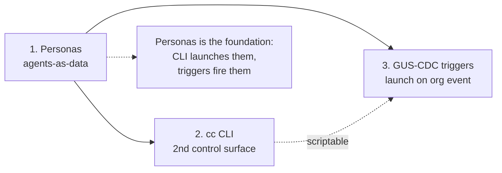
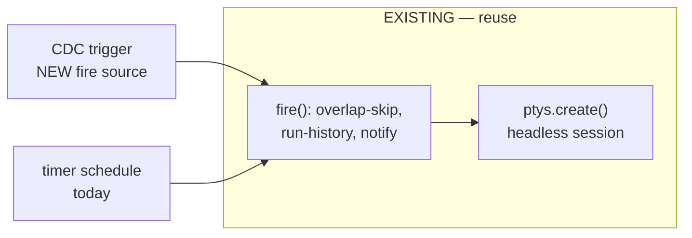
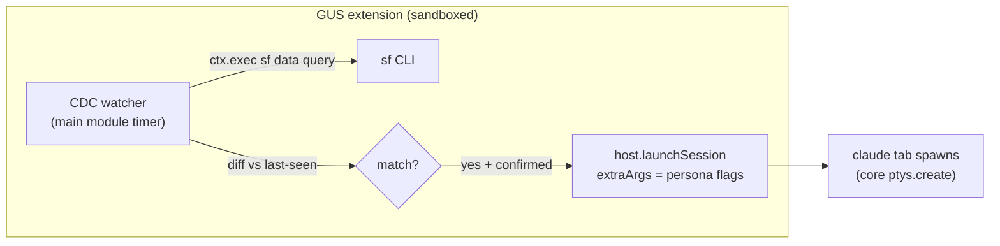
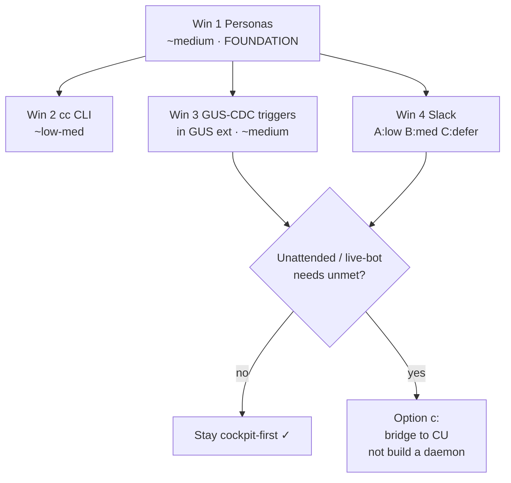

# Cheap Wins from the CU Analysis — Implementation Plan

> Planning doc 2026-06-12 (updated to add Slack + revise CDC home). Follow-up to
> [`claude-unleashed-comparison.md`](./claude-unleashed-comparison.md).
> The highest-value, lowest-cost moves that need **no daemon** and keep our
> cockpit-first identity. Sequenced; each builds on the last. **Planning only — no
> code written yet.** File:line references verified against current `src/`.

**Four wins:** (1) Personas, (2) `cc` CLI, (3) GUS-CDC triggers **inside the GUS
extension**, (4) Slack integration. Personas is the foundation; CDC and Slack both
reuse it. Slack and CDC are the two that most directly "simplify your processes."

## Why these three, in this order



Personas first because it's the **foundation** — it turns our 4 hardcoded profiles
into a data-driven launch layer that both the CLI and the event-trigger then reuse.
The CLI and CDC trigger are independent of each other and could be done in either
order, but both are *more useful* once personas exist (you launch a *named role*, not
a bare `claude`).

The unifying architectural fact: **`scheduler.fire()` → `ptys.create()` (`scheduler.ts:401,471`)
is already a generic "trigger → launch a session" machine.** A schedule is a
timer-driven fire; a CDC event is an event-driven fire. Win #3 is "a new fire
source," not a new launch path. This is why all three are cheap.

---

## Win 1 — Personas (agents-as-data)

**This is our parked [`personas-plan.md`](./personas-plan.md), validated by the CU analysis.**
CU's agent YAML is the reference schema; our plan already mirrors it. No re-planning
needed — the existing 4-phase plan stands. Summary of why it's cheap and what it buys:

- **What it buys:** replaces the 4-value `LaunchProfileId` union with named, reusable
  roles (Reviewer, Architect, Bug-hunter…) defined as JSON — CU's single biggest
  "data not code" idea, matchable *without* any worktree/daemon machinery.
- **Why it's cheap:** the launch path in `pty.ts` (`resolveLaunch` → `globalClaudeArgs`
  → `projectSettingsArgs` → extraArgs, `pty.ts:497–561`) is *already a layered profile
  system*. A persona is one more layer (`personaArgs()`) inserted between AppConfig
  globals and ProjectSettings. The discovery/merge/hot-reload store is a verbatim fork
  of `template-store.ts` (builtin ⊕ user dir ⊕ project dir, precedence-merge, fs.watch
  → `onChanged`). ~90% of the plumbing exists.
- **Schema alignment with CU** (adopt their field names where sensible so a CU agent
  YAML is ~mechanically portable to a CCTC persona): `appendSystemPrompt`(`systemPrompt`),
  `model` alias, `permissionMode`, `allowedTools`/`deniedTools` (CU's `disallowedTools`),
  `addDirs`, `initialPrompt`, plus our `baseProfile`/`icon`/`scope`. CU extras worth
  copying later: `archetype` (drives default icon/grouping), `maxTurns` (no native CCTC
  equivalent yet — would need a turn-cap mechanism; **defer**).
- **Plan of record:** the 4 phases in `personas-plan.md` (Core resolution → Spawn UX →
  Panel → optional `--agents`/Zana hand-off). **No changes to that plan.** Start at its
  Phase 1.
- **Cost:** medium. ~2 new files (`persona-store.ts` + test) + edits to ~11 known sites
  (all enumerated in `personas-plan.md` "Touched files").

**One refinement from the CU analysis:** when authoring the builtin starter personas,
lift them from CU's shipped `planner`/`executor`/`reviewer` agent prompts
(`.claude-unleashed/agents/*.yaml`) rather than inventing prompts — they're battle-tested.

---

## Win 2 — A thin `cc` CLI over our stores

**What it buys:** a second control surface — CU's cheapest piece of leverage. Makes
CCTC scriptable, and (per CU's "all UI driveable by Claude" principle) lets an agent
drive the cockpit. No daemon: the CLI is a thin client over the same `~/.cc-center/*.json`
stores the app already reads, plus IPC to a *running* app for live actions.

### Two-tier design (the key decision)

The app holds the live PTYs in-process, so the CLI splits into two capability tiers:

| Tier | Works when app is… | Mechanism |
|---|---|---|
| **Read / author** (list projects, personas, schedules, inbox; create a schedule; write a persona JSON) | open *or* closed | Direct read/write of `~/.cc-center/*.json` — same stores, same atomic tmp+rename. |
| **Live actions** (launch a session *now*, run-a-schedule-now, tail a session) | app must be open | A localhost control socket the app exposes (extend the existing MCP http server in `mcp-server.ts`, or a tiny sibling) — the CLI POSTs an intent; the app calls `ptys.create()`. |

Read/author tier is the bulk of the value and is trivial (no IPC). Live actions reuse
the launch path that already exists; the only new surface is a localhost endpoint that
maps an HTTP intent → `ptys.create(...)` (the same call `index.ts:598` and
`scheduler.ts:471` already make).

### Surface (v1)

```
cc projects ls
cc personas ls
cc run <project> --persona reviewer [--prompt "..."]   # live action → app
cc schedule ls | run-now <id>                          # author + live
cc inbox ls | show <id>                                # read store
cc inbox push --project <id> --comment "..."           # author (same as MCP inbox_push)
```

### Notable design points
- **Reuse, don't reinvent:** the CLI's `run` builds a `CreateTerminalRequest` and hands
  it to the app; all profile/persona/MCP/hook assembly stays in `pty.ts`. The CLI never
  assembles `claude` argv itself.
- **JSON-first output** (`--json` on every command) so it's agent-drivable — copy CU's
  `runCli()` returns-a-result-object discipline (never `process.exit` mid-logic),
  which also makes it golden-file testable.
- **Discovery of the running app:** the app writes its control-socket URL/port to a
  well-known file (`~/.cc-center/control.json`) on boot (mirrors how `CC_MCP_URL` is
  already derived); the CLI reads it. Absent file = "app not running, live actions
  unavailable, read/author still works."

### Cost & shape
- **Cost:** low-medium. New `packages/cli/` (or a `bin/` entry) — a small Node/TS program
  depending only on the shared types + store-read helpers. The one genuinely new piece is
  the app-side control endpoint for live actions (~the size of one more MCP route).
- **Touched:** new `packages/cli/`; `src/main/mcp-server.ts` (or new `control-server.ts`)
  for the live-action endpoint; `src/main/index.ts` to write `control.json` on boot;
  reuse `src/shared/types.ts` + store readers.
- **Scope guard v1:** read/author tier + `run` + `schedule run-now`. No `tail`/streaming
  in v1 (that's where it gets daemon-ish). No remote.

---

## Win 3 — GUS CDC-style event triggers

**What it buys:** the most *differentiated* automation we could ship — "launch a
persona-session when a Salesforce work item changes" — and it's unusually within reach
because **we already spawn `sf`** via the GUS extension (`extensions/gus`, brokered
`ctx.exec({bin:'sf'})`, `execAllowlist:['sf']`). CU's GUS CDC is live Pub/Sub off the
local `sf` session; we can ship a leaner version first and grow into Pub/Sub.

### The architectural fit (why it's cheap)

A trigger is **a new fire source for the existing launch machine.** `scheduler.fire()`
already does overlap-skip, run-history, inbox-notify, and `ptys.create()` headless
(`scheduler.ts:401–494`). An event trigger reuses all of that — it just replaces "timer
elapsed" with "watched work item changed."



### Two-stage delivery

**Stage A — Poll-based (ship first, no Pub/Sub).** A main-side watcher runs a SOQL
query on an interval (`sf data query` via the same brokered exec the GUS extension uses),
diffs against last-seen state (replay-id/SystemModstamp), and fires a session per changed
work item. This is "a schedule whose body is a SOQL diff" — almost entirely existing
machinery. Per-field scoping (CU's cost boundary: `--field Status__c` cuts noise 10–100×)
becomes a query/filter clause. Cheapest path to the capability; good enough for most org
workflows.

**Stage B — Pub/Sub (grow into it).** Replace the poll with a real subscription to
Salesforce's change-event stream (the CU model). Lower latency, no polling cost, but
needs a long-lived gRPC/Pub/Sub client + replay-id durability — more weight. **Defer to
Stage B only if poll latency proves inadequate.**

### Trigger schema (mirrors a schedule + CDC scope)

```jsonc
{
  "id": "bug-triaged-watcher",
  "name": "Investigate newly-triaged bugs",
  "projectId": "...",
  "source": { "kind": "gus-cdc",
    "object": "ADM_Work__c",
    "changeType": ["CREATE", "UPDATE"],
    "fields": ["Status__c"],            // scope = cost boundary (CU's lesson)
    "scope": { "assignee": "me", "scrumTeam": "..." },
    "pollEvery": "2m"                    // Stage A only
  },
  "launch": { "personaId": "bug-hunter", // reuses Win 1
    "promptTemplate": "Investigate {{ workItemName }} ({{ status }}). {{ description }}"
  },
  "requireConfirm": true                 // CU's --require-human: queue, don't auto-fire
}
```

### Where the watcher lives — **inside the GUS extension** (revised)

The first draft put the watcher in core (`src/main/cdc-watcher.ts`). On inspection of the
extension host, **the GUS extension is the better home** — and it's the cleaner answer:

- The GUS extension **already holds the only sanctioned `sf` access** (brokered
  `ctx.exec({bin:'sf'})`, `execAllowlist:['sf']`, `extension.json`). A core watcher would
  need its *own* `sf` spawn, duplicating that capability outside the sandbox.
- Extension main modules **can run timers and watchers** — the SDK's `MainModule.teardown()`
  exists precisely to clean up "timers, fs/file watchers, child processes, open sockets"
  on hot-reload (`packages/extension-sdk/src/main.ts:128`). A poll loop is a legitimate,
  already-supported extension lifecycle.
- Extensions **can launch sessions**: `host.launchSession({projectId, extraArgs, title, cwd})`
  (`renderer.ts:167`, impl `src/renderer/modules/host.ts:225`) spawns a `claude` tab with
  arbitrary flags — and a persona is *exactly* "a set of `claude` flags." So a CDC match
  → `launchSession(extraArgs: personaArgs(persona))` is the whole launch path, already
  built. It's gated by a `session:launch` permission and sanitizes the denylist
  (`--dangerously-skip-permissions`, `--mcp-config`) so the extension can't launch an
  auto-approving agent — a safety property a core watcher would have to re-earn.

So Win 3 becomes **"upgrade the GUS extension with a CDC watcher + trigger UI,"** which is
exactly your instinct. It keeps the sandbox boundary intact and reuses three things the
extension already has (brokered `sf`, lifecycle timers, `launchSession`).



**Open dependency:** today `launchSession` always uses the base `claude` profile and takes
`extraArgs`. To launch a *persona*, either (a) the extension resolves the persona → flags
itself (needs a host getter `host.listPersonas()` / `host.resolvePersonaArgs(id)`), or
(b) `launchSession` gains an optional `personaId` the host resolves. **Lean: (b)** — keep
persona resolution host-side (single source of truth in `pty.ts`), extension just names
the persona. This is a small additive change to the `launchSession` contract.

### Notable design points
- **Reuse the persona launch (Win 1):** the trigger names a `personaId` and a
  `promptTemplate` with `{{ }}` substitution from the work-item fields (CU's exact token
  model). This is *why personas come first.*
- **Scope-before-enable safeguard:** copy CU's hard lesson — a bare `UPDATE` subscription
  fires on every org edit (each a paid session). Default new triggers to **disabled +
  `requireConfirm`**, and require at least one `fields` entry, so the first fire is a
  deliberate test, not a 3 AM session storm.
- **`requireConfirm` = CU's `--require-human`:** the trigger fires into a *queued* state
  surfaced in the inbox ("3 work items matched — launch sessions?"), not straight to a
  spawned tab. Keeps a human in the loop, which fits our cockpit identity better than
  CU's unattended default. The extension pushes the queued match via `inbox_push`.

### Cost & shape
- **Cost:** medium (Stage A poll); high (Stage B / Pub/Sub — defer).
- **Touched:** GUS extension — new watcher module + `cdc` trigger storage (extension
  `ctx.storage`) + a CDC config tab in its renderer panel; the trigger spec type
  (extension-local or shared). Core changes are *small and additive*: extend
  `launchSession` with optional `personaId` (`host.ts:225`, `renderer.ts:167`), and a
  `host.listPersonas()` getter once Win 1 lands. **No core watcher, no `scheduler.ts`
  refactor** (revised from the first draft).
- **Scope guard v1:** Stage A poll only; `ADM_Work__c` (GUS work items) only;
  `requireConfirm` default on; single org (the user's `sf` default).

---

## Win 4 — Slack integration

**What it buys:** the surface most likely to "simplify a lot of your processes" — turn
Slack into both an *output* (CCTC/agents notify you in Slack) and an *input* (you trigger
sessions from Slack) channel, so you're not tied to the app window. CU treats Slack as a
co-equal control surface (start/complete/fail/stuck notifications, `run <prompt>` to
launch, thread-per-session, interactive approval buttons).

### What we already have (don't rebuild it)

**There is zero Slack code in `src/main` today** — Slack is reached *only* through the
`mcp__slack__*` MCP tools, driven by two builtin scheduler templates in
`template-store.ts:102–190`:
- **`slack-mention-triage`** — every 30 min, finds @mentions/DMs/thread replies, classifies
  (action/fyi/noise), pushes a digest to the inbox.
- **`slack-agent-runner`** — every 15 min, finds your messages starting with `[agent]`,
  runs the instruction in the project cwd, replies in-thread (the reply is the idempotency
  marker).

So **inbound "act on Slack via an agent" already works** through scheduled agent sessions
+ the Slack MCP. That's a real asset and the cheapest layer. The gaps are: (1) **outbound
notifications** are agent-mediated (an agent has to run and choose to push) rather than
automatic on session lifecycle; (2) the `[agent]` runner is a *poll*, not a live listen;
(3) no first-class "Slack settings" surface — it's buried in schedule prompts.

### Three tiers, cheapest first

| Tier | Capability | Mechanism | Cost |
|---|---|---|---|
| **A — formalize what exists** | Ship the two Slack templates as first-class, configurable features (channel, interval, `[agent]` token) with a small **Slack settings pane**; document the MCP-tool path. | Promote `template-store` builtins → a `SlackPanel` that authors the same schedules with friendly fields. | **low** |
| **B — automatic outbound** | CCTC posts to Slack on **session lifecycle** (done / blocked / scheduled-run-complete) and on **inbox push**, without an agent in the loop. | Reuse the live-status signals we already emit (`agent-status.ts` idle/working/blocked; scheduler `notifyInboxOnExit`). Add a Slack notifier that calls the Slack Web API (a brokered `fetch`, or — cleanest — a tiny **Slack extension** mirroring GUS: `fetch` permission, `egressAllowlist:['slack.com']`). | **medium** |
| **C — live inbound bot** | A real bot: `run <prompt>` in a channel launches a session; thread-per-session; reply-in-thread = hint; approve/deny buttons. | This is CU's full model and needs a **persistent socket-mode listener** — i.e. it wants the daemon we're deliberately avoiding. **Defer / delegate.** | **high** |

### Recommendation
- **Do Tier A now** (low cost, immediate process simplification — makes the existing Slack
  agents discoverable and configurable instead of hidden in prompt text).
- **Do Tier B next** — automatic lifecycle notifications are the highest "stop watching the
  window" value. Build it as a **Slack extension** (same shape as GUS: brokered `fetch`,
  consent-gated, `egressAllowlist`), which keeps it out of core and reuses the extension
  security model. Outbound-only = no persistent listener = no daemon.
- **Defer Tier C** (live bot). It's the one Slack piece that genuinely wants a daemon; if
  you need it, that's another **"bridge to CU"** candidate — CU already has the Slack bot,
  so point its bot at sessions rather than rebuilding socket-mode in CCTC.

### Notable design points
- **Outbound as an extension, not core** — mirrors the GUS decision: a `slack` extension
  with `fetch` + `egressAllowlist:['slack.com','hooks.slack.com']` gets Slack notifications
  without a core dependency or a stored bot token in our JSON. Consent-gated like any
  extension.
- **Lifecycle hooks already exist** — `agent-status.ts` already distinguishes
  idle/working/**blocked**; a Slack "needs your input" ping on `blocked` is the single most
  useful notification and the signal is already there.
- **Persona + Slack:** a Slack notification on a persona-session completing closes the loop
  with Win 1 (e.g. "Reviewer finished on `repo` — 3 findings").

### Cost & shape
- **Cost:** low (Tier A) → medium (Tier B) → high/defer (Tier C).
- **Touched (A+B):** `SlackPanel.tsx` (new, clone `SchedulerPanel`) + wire into `Sidebar`;
  promote the two `template-store.ts` builtins to documented config; new `slack` extension
  (`extensions/slack/`, fork `extensions/gus/` shape) for outbound; a notifier hook off
  `agent-status` + scheduler exit. No core Slack token storage.

---

## Sequencing & the daemon question



**Suggested order:** Win 1 (Personas) → then Win 4 Tier A (formalize existing Slack, ~free)
in parallel with Win 2 (CLI) → then Win 3 (CDC in GUS ext) + Win 4 Tier B (outbound Slack
extension), which both reuse personas and the extension model. All respect **no-daemon**.

The places we brush against the daemon line, and the consistent answer (**bridge to CU,
don't rebuild it** — comparison report §4.4):
- **Win 2 live actions** and **Win 3 polling** want the app open — consistent with a
  cockpit you sit in.
- **Win 3 → CU:** if "fire while app closed / Mac asleep" becomes real, the GUS-ext watcher
  fires `cu run` instead of `host.launchSession` — CCTC becomes CU's front-end with almost
  no new code.
- **Win 4 Tier C (live Slack bot)** is the clearest daemon-wanting piece; CU already *has*
  a Slack bot, so that's a delegate-to-CU, not a build.

## Open questions to resolve before building
1. **CLI packaging** — `packages/cli/` workspace package vs. a `bin/` script? (Lean:
   workspace package, mirrors `packages/extension-sdk`.)
2. **Control endpoint** — extend `mcp-server.ts` with a `/control/*` route family, or a
   separate `control-server.ts` on its own port? (Lean: separate server — keep MCP
   surface clean, different auth posture.)
3. **CDC `sf` invocation** — ~~core watcher vs extension~~ **resolved: inside the GUS
   extension** (reuses its brokered `sf` + lifecycle timers + `launchSession`). Remaining
   sub-question: does the CDC trigger spec live extension-local (`ctx.storage`) or as a
   shared core type? (Lean: extension-local for v1; promote to shared only if the CLI/other
   surfaces need to read triggers.)
4. **Persona ↔ trigger coupling** — does a CDC trigger *require* a persona, or also
   accept a bare `baseProfile`+prompt? (Lean: accept both; persona optional, mirrors
   how schedules take a bare `profile` today.)
5. **`launchSession` persona support** — add optional `personaId` to the `launchSession`
   host contract (host resolves), vs. expose `host.resolvePersonaArgs(id)` and let the
   extension pass flags? (Lean: `personaId` on `launchSession` — keeps persona resolution
   single-sourced in `pty.ts`.) Needed by Win 3 and any persona-aware Slack notification.
6. **Slack outbound transport** — a dedicated `slack` extension (brokered `fetch`,
   `egressAllowlist`, consent-gated, no core token) vs. a core Slack notifier? (Lean:
   extension — mirrors GUS, keeps tokens/egress out of core.)
