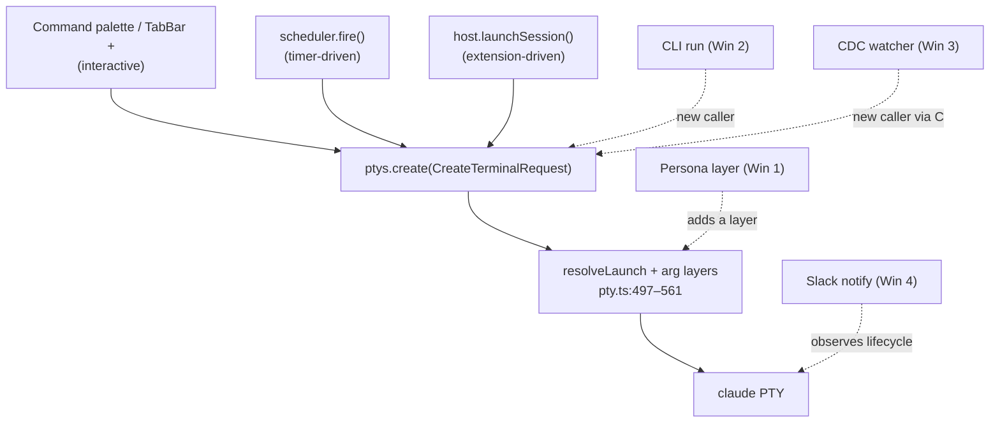
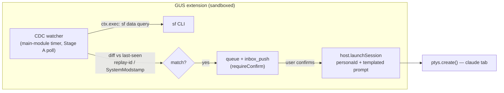
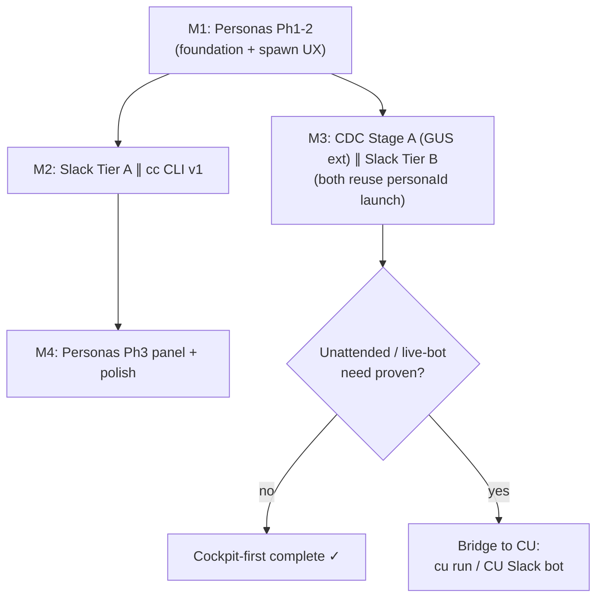

# CU-Parity Master Plan — Personas, CLI, GUS-CDC, Slack

> Master implementation plan, 2026-06-12. The build-ready expansion of
> [`cu-cheap-wins-plan.md`](./cu-cheap-wins-plan.md), grounded in
> [`claude-unleashed-comparison.md`](./claude-unleashed-comparison.md).
> Scope: four features that bring the highest-value CU capabilities to CCTC **without a
> daemon**, keeping our cockpit-first identity. All file:line refs verified against
> current `src/` (2026-06-12).

---

## 0. Orientation

### 0.1 The thesis (one paragraph)
CU is an autonomous fleet; CCTC is the human's cockpit. We are **not** chasing CU's daemon,
Overseer, swarms, or Salesforce Workspaces. We are lifting the four CU ideas that make an
*operator's* life easier and that ride machinery we already have: **named reusable agents
(Personas)**, a **scriptable/agent-drivable control surface (CLI)**, **event-driven launches
(GUS-CDC)**, and **a notification + remote-trigger channel (Slack)**. Where any of these
genuinely needs a persistent process, the answer is *bridge to CU*, not *become CU*.

### 0.2 The single architectural insight that makes this cheap
Three launch entry points already converge on **one** mechanism:



- **Personas** = one more arg-assembly layer in `pty.ts` (`resolveLaunch` →
  `globalClaudeArgs` → **personaArgs (NEW)** → `projectSettingsArgs` → extraArgs).
- **CLI / CDC** = new *callers* of the existing `ptys.create()` / `host.launchSession()`.
- **Slack** = an *observer* of session lifecycle (`agent-status` + scheduler exit) plus a
  reuse of the existing `mcp__slack__*` agent path.

Nothing here invents a new launch path. That is the whole reason it's a "cheap wins" plan.

### 0.3 Verified anchors (the load-bearing existing code)
| Anchor | Location | Role |
|---|---|---|
| `resolveLaunch` + arg layers | `src/main/pty.ts:497–561` | where the persona layer slots in |
| `LaunchProfileId` (4-value union) | `src/shared/types.ts:1` | what Personas generalizes |
| `CreateTerminalRequest` | `src/shared/types.ts:343–358` | the launch request shape (gains `personaId`) |
| `ProjectSettings` | `src/shared/types.ts:324–341` | the de-facto "unnamed persona" we mirror |
| `TemplateStore` (discovery/merge/watch) | `src/main/template-store.ts` | verbatim fork target for `persona-store` + `cdc` |
| `scheduler.fire()` → `ptys.create()` | `src/main/scheduler.ts:401–494` | the trigger→launch machine |
| `ScheduleCreateInput` | `src/shared/types.ts:598–615` | shape to mirror for CDC trigger spec |
| `host.launchSession` impl | `src/renderer/modules/host.ts:225–258` | extension→session, gains `personaId` |
| `launchSession` SDK contract | `packages/extension-sdk/src/renderer.ts:167` | contract to extend |
| GUS extension `sf` exec | `extensions/gus/` (`execAllowlist:['sf']`) | CDC's sanctioned `sf` access |
| MainModule lifecycle (timers ok) | `packages/extension-sdk/src/main.ts:117–130` | CDC watcher can live here |
| Slack-via-MCP today | `src/main/template-store.ts:102–190` | existing inbound Slack (formalize, don't rebuild) |
| Live status (idle/working/blocked) | `src/main/agent-status.ts` | the signal Slack outbound observes |
| IPC registry | `src/shared/ipc.ts` (`scheduler:`, `inbox:`, `extensions:`…) | add `personas:` namespace |

### 0.4 Global guardrails (apply to every win)
1. **Additive, never destructive.** `LaunchProfileId` stays the 4-value union; every
   existing launch site keeps working. New concepts sit *beside* old ones.
2. **No daemon.** App-open is an acceptable precondition for live actions. Anything wanting
   persistence routes to CU.
3. **No secrets in core JSON.** Slack tokens / org creds live behind the extension broker
   (`fetch`/`exec` caps + allowlists + consent), never in `~/.cc-center/*.json`.
4. **Reuse the store template.** `persona-store` and the CDC trigger store are forks of
   `template-store.ts` (builtin ⊕ user dir ⊕ project dir, precedence-merge, fs.watch →
   `onChanged`). Don't invent a new persistence pattern.
5. **Test parity.** Every new store gets a merge/precedence/scope unit test; every new
   arg-assembly path gets a pure layer-order test; every new view gets a render + a
   state-change test (the project's existing bar).
6. **Human-in-the-loop default.** Auto-launch features (CDC) default to
   disabled + confirm — fits the cockpit, avoids paid-session storms.

---

## WIN 1 — Personas (the foundation)

**Goal:** named, reusable Claude roles defined as data, launchable into tabs, schedules,
and (later) CDC triggers. Generalizes the 4-value `LaunchProfileId` into a data-driven
launch layer. This is our parked [`personas-plan.md`](./personas-plan.md), validated against
CU's agent schema; the master plan supersedes nothing there — it sequences it as feature 1.

### 1.1 Type model (`src/shared/types.ts`)
```ts
export interface Persona {
  id: string;                    // kebab; filename stem; shadow rule like ScheduleTemplate
  name: string;
  icon?: string;                 // lucide name; fallback resolved in profileIcon
  description?: string;
  archetype?: 'developer' | 'reviewer' | 'architect' | 'security' | 'writer' | 'other';
  baseProfile?: LaunchProfileId; // default 'claude'
  model?: string;                // → --model (alias-friendly: opus/sonnet/haiku/default)
  permissionMode?: ProjectSettings['permissionMode']; // → --permission-mode (skip for yolo)
  appendSystemPrompt?: string;   // → --append-system-prompt
  allowedTools?: string[];       // → --allowedTools (merged/deduped w/ project)
  deniedTools?: string[];        // → --disallowedTools
  addDirs?: string[];            // → --add-dir
  mcpServers?: string[];         // optional; names resolved via mcp registry (Phase 1.5)
  subagents?: string[];          // optional → --agents (Phase 4)
  initialPrompt?: string;        // written to pty after spawn (interactive) / positional (scheduled)
  source?: 'builtin' | 'user' | { projectId: string; projectName: string };
  scope?: { projectTags?: string[] }; // which projects surface this persona; default ['*']
}
```
Additive field on existing types: `personaId?: string` on `CreateTerminalRequest`,
`TerminalSession`, `ScheduledTask`, `ScheduleCreateInput`; `defaultPersonas?: string[]` on
`Project` (parallels `defaultAgents`).

### 1.2 Phases & tasks

**Phase 1 — Core resolution (no UI). Launch a persona from hand-written JSON.**
- `src/shared/types.ts` — add `Persona`; add `personaId?` to the 4 types above.
- `src/main/persona-store.ts` (**fork `template-store.ts`**) — builtin catalogue + user dir
  (`~/.cc-center/personas/`) + project dir (`<repo>/.cc-center/personas/`), precedence-merge
  by id, fs.watch → `onChanged`, `revealUserDir`. Validation mirrors `readTemplateFile`
  (`template-store.ts:259`).
- `src/main/pty.ts`:
  - `personaArgs(persona, baseProfile)` — same shape/precedence rules as
    `projectSettingsArgs` (`pty.ts:535`); inserted **after** `globalClaudeArgs`, **before**
    `projectSettingsArgs`, so project/tab still override.
  - `create()` accepts a resolved `persona?: Persona`; `command/baseArgs` resolve from
    `persona.baseProfile ?? req.profile`.
  - `buildRemoteCmd` gets the same persona layer (remote parity, minus MCP).
  - Post-spawn `initialPrompt`: claude-family only; pty-write `prompt + "\r"` for
    interactive, positional-argv for scheduled (see `scheduler.ts` prompt path).
  - `--allowedTools` dedup must compose persona + project (extend `mergeAllowedTools`,
    `pty.ts:581`).
- `src/main/mcp-config.ts` — allow persona-named MCP servers into the per-project
  `.mcp.json` alongside `cc-inbox` (registry lookup; **Phase 1.5**, can stub first).
- `src/shared/ipc.ts` — add `personas: { list, onChanged, revealDir }`.
- `src/preload/index.ts` + `src/main/index.ts` — register `personas:*`; resolve persona by
  id at create time; pass resolved `Persona` into `ptys.create`.
- `src/main/scheduler.ts` — `ScheduledTask.personaId` resolved + passed through `fire()`.
- **Tests:** `persona-store.test.ts` (merge/precedence/scope/shadow); `pty` arg-assembly
  unit test (layer order + allowedTools dedup with persona present); remote-parity test.
- **Builtin starters:** seed from CU's shipped prompts (`.claude-unleashed/agents/
  {planner,executor,reviewer}.yaml`) → Reviewer + Architect + Bug-hunter.

**Phase 2 — Spawn UX.** `Project.defaultPersonas`; `usePersonas` store slice (clone
`useScheduleTemplates`); "+" picker lists builtins + personas grouped with icon + source
badge (`TabBar.tsx`/`Workspace.tsx`); `personaIcon()` in `profileIcon.tsx`; tab chip shows
persona icon when `session.personaId` set.

**Phase 3 — Management panel.** `PersonasPanel.tsx` (clone `SchedulerPanel`/`SkillsPanel`):
list/group by source, reveal dir, per-project default toggles, "New from template". Wire
into `Sidebar.tsx` + `CommandPalette.tsx`. Project-shipped personas surface with a "project"
source badge.

**Phase 4 — Optional escalation.** `subagents` → `--agents`; `persona.promoteTo:
"zana-team:<template>"` hand-off to Zana team/council (no daemon dep).

### 1.3 Acceptance
A hand-written `~/.cc-center/personas/reviewer.json` appears in the "+" picker, launches a
`claude` tab with the right `--append-system-prompt`/`--model`/`--allowedTools`, project
settings still override it, and a scheduled task with `personaId` fires it headless.

### 1.4 Cost / risk
Medium; ~2 new files + ~11 edited sites (all enumerated in `personas-plan.md`). Risk is low
(purely additive). The one subtlety is allowedTools composition — covered by a dedicated
test.

---

## WIN 2 — `cc` CLI (second control surface)

**Goal:** a scriptable, agent-drivable CLI over the same stores + a running app. CU's
cheapest leverage; needs no daemon. Embodies CU's "all UI driveable by Claude" principle.

### 2.1 Two capability tiers (the core decision)
| Tier | Works when app… | Mechanism |
|---|---|---|
| **Read / author** | open *or* closed | Direct read/write of `~/.cc-center/*.json` (same atomic tmp+rename helpers). |
| **Live actions** | open only | A localhost **control endpoint** the app exposes; CLI POSTs an intent → app calls `ptys.create()`. |

### 2.2 App discovery
App writes `~/.cc-center/control.json` `{ url, port, pid, startedAt }` on boot (mirrors how
`CC_MCP_URL` is derived in `pty.ts`); removes/staling it on quit. CLI reads it; absent =
"app not running → live actions unavailable, read/author still works."

### 2.3 Surface (v1)
```
cc projects ls [--json]
cc personas ls [--json]
cc run <project> [--persona <id>] [--profile <p>] [--prompt "..."]   # live
cc schedule ls | run-now <id>                                        # author + live
cc inbox ls | show <id>                                              # read store
cc inbox push --project <id> --comment "..." [--doc path]            # author
cc status                                                            # app up? live sessions?
```

### 2.4 Tasks
- New workspace package `packages/cli/` (mirrors `packages/extension-sdk` layout): thin TS
  program, deps = shared types + a small store-reader lib. `runCli(argv)` returns
  `{exitCode, stdout, stderr}` — never `process.exit` mid-logic (CU discipline → golden-file
  testable).
- `src/main/control-server.ts` (NEW; **separate** from `mcp-server.ts` — clean MCP surface,
  distinct auth posture) — localhost-bound, token in `control.json`, routes:
  `POST /run` (→ `ptys.create`), `POST /schedule/:id/run-now`, `GET /status`.
- `src/main/index.ts` — start control-server on boot, write/clear `control.json`.
- Reuse store readers; do **not** duplicate launch arg assembly — `cc run` builds a
  `CreateTerminalRequest` and the app assembles flags.
- **Tests:** golden-file CLI output tests; control-server route tests (app-side); a
  "store-read works with app closed" test.

### 2.5 Scope guard / cost
v1 = read/author + `run` + `schedule run-now` + `status`. **No** `tail`/streaming (daemon-ish),
no remote. Cost low-medium; the only genuinely new surface is the control endpoint (~one MCP
route's worth).

---

## WIN 3 — GUS-CDC event triggers (inside the GUS extension)

**Goal:** launch a persona-session when a Salesforce work item changes. The most
*differentiated* automation we can ship, and it lives **in the GUS extension** — which
already owns sanctioned `sf` access, can run lifecycle timers, and can launch sessions.

### 3.1 Why the GUS extension is the home (decided)
- Only sanctioned `sf` access lives there (brokered `ctx.exec({bin:'sf'})`,
  `execAllowlist:['sf']`). A core watcher would duplicate that capability outside the sandbox.
- Extension main modules may run timers/watchers — `MainModule.teardown()` exists to clean
  up "timers, fs/file watchers, child processes" on hot-reload
  (`packages/extension-sdk/src/main.ts:128`).
- `host.launchSession({projectId, extraArgs, title, cwd})` (`host.ts:225`) already spawns a
  `claude` tab with arbitrary flags = a persona's flags, gated by `session:launch` and
  denylist-sanitized (`--dangerously-skip-permissions`/`--mcp-config` stripped).



### 3.2 Trigger spec (extension-local `ctx.storage` for v1; mirrors `ScheduleCreateInput`)
```jsonc
{
  "id": "bug-triaged-watcher",
  "name": "Investigate newly-triaged bugs",
  "projectId": "...",
  "enabled": false,                      // default OFF (scope-before-enable)
  "object": "ADM_Work__c",
  "changeType": ["CREATE", "UPDATE"],
  "fields": ["Status__c"],               // ≥1 required — the cost boundary (CU's lesson)
  "scope": { "assignee": "me", "scrumTeam": "..." },
  "pollEvery": "2m",                      // Stage A
  "launch": {
    "personaId": "bug-hunter",            // reuses Win 1
    "promptTemplate": "Investigate {{ workItemName }} ({{ status }}). {{ description }}"
  },
  "requireConfirm": true                  // CU's --require-human
}
```

### 3.3 Two-stage delivery
- **Stage A — poll (ship first).** Interval `sf data query` (SOQL) via brokered exec; diff
  vs last-seen (replay-id / `SystemModstamp` in `ctx.storage`); per-field scope = WHERE
  clause. "A schedule whose body is a SOQL diff." Good enough for most org flows.
- **Stage B — Pub/Sub (defer).** Real change-event subscription (CU's model). Lower latency,
  no poll cost, but needs a durable gRPC client + replay-id durability. Only if poll latency
  proves inadequate.

### 3.4 Tasks
- GUS extension: new watcher module (timer + SOQL diff + `ctx.storage` last-seen); CDC config
  tab in its renderer panel (list/create/enable triggers, source-scoped); `inbox_push` of
  queued matches.
- **Core (small, additive):** extend `launchSession` contract with optional `personaId`
  (`renderer.ts:167` + impl `host.ts:225`, host resolves via persona-store); add
  `host.listPersonas()` getter (once Win 1 lands).
- `{{ }}` token substitution from work-item fields (CU's exact token model).
- **Tests:** SOQL-diff unit test (new/changed/unchanged); token-substitution test;
  `launchSession({personaId})` resolves persona flags test; scope-required validation test.

### 3.5 Scope guard / cost
Stage A only; `ADM_Work__c` only; `requireConfirm` default on; single org (user's `sf`
default). Cost medium (A) / high (B, deferred). **No core watcher, no scheduler refactor.**

---

## WIN 4 — Slack integration

**Goal:** make Slack both an output (notify) and input (trigger) channel so you're not tied
to the window. **Key fact: there is zero Slack code in `src/main` today** — Slack works only
through `mcp__slack__*` tools driven by two builtin scheduler templates
(`template-store.ts:102–190`). So inbound "act via an agent" already works; the gaps are
automatic outbound + a real settings surface + (optionally) a live bot.

### 4.1 Three tiers, cheapest first
| Tier | Capability | Mechanism | Cost |
|---|---|---|---|
| **A — formalize** | The two Slack agent-templates become first-class configurable features + a **Slack settings pane**. | Promote `template-store` builtins → `SlackPanel` authoring the same schedules with friendly fields (channel, interval, `[agent]` token). | low |
| **B — auto outbound** | CCTC posts on **session lifecycle** (done/blocked/scheduled-complete) and **inbox push**, no agent in the loop. | A **`slack` extension** (fork `extensions/gus/`): `fetch` cap + `egressAllowlist:['slack.com','hooks.slack.com']`, consent-gated; a notifier hook off `agent-status` (`blocked` signal) + scheduler exit. | medium |
| **C — live bot** | `run <prompt>` in-channel → session; thread-per-session; reply = hint; approve/deny buttons. | Persistent socket-mode listener → **wants a daemon**. **Defer/delegate to CU** (CU already has the bot). | high |

### 4.2 Why outbound is an extension, not core
Mirrors the GUS decision: a `slack` extension keeps the **bot token + egress** behind the
broker (consent + allowlist), never in `~/.cc-center/*.json`. The most useful single
notification is a **"needs your input" ping on `blocked`** — and `agent-status.ts` already
emits that state, so Tier B is "observe a signal we already have + brokered `fetch` to
Slack."

### 4.3 Tasks (A + B)
- `SlackPanel.tsx` (clone `SchedulerPanel`) + `Sidebar` wiring; promote the two
  `template-store.ts` builtins to documented, friendly-config schedules.
- `extensions/slack/` (fork GUS shape): `fetch`/`egressAllowlist`, consent, a notifier
  capability the host can call on lifecycle events.
- Notifier hook: subscribe to `agent-status` (`blocked`) + scheduler `notifyInboxOnExit`
  (`scheduler.ts:551`) → post to Slack via the extension.
- **Tests:** SlackPanel render + state-change; notifier "posts on blocked / on scheduled
  exit" test (extension fetch mocked); egress-allowlist enforcement test.

### 4.4 Scope guard / cost
A then B; **defer C**. No core token storage. Low → medium.

---

## SEQUENCING, MILESTONES & THE DAEMON LINE



**Recommended milestones**
- **M1 — Personas Phases 1–2.** The foundation. Everything else launches a *named role*.
- **M2 — Slack Tier A ∥ CLI v1.** Both near-free, both immediately useful, independent.
- **M3 — CDC Stage A ∥ Slack Tier B.** Both depend on `launchSession({personaId})` /
  persona resolution from M1; both are extension work; can run in parallel.
- **M4 — Personas Phase 3 panel + cross-feature polish** (persona-aware Slack messages,
  CLI `run --persona` ergonomics, CDC trigger panel UX).

**The daemon line — one consistent answer.** Three places brush against persistence:
`cc` live actions (app must be open), CDC poll (app must be open), live Slack bot (wants a
listener). For the first two, app-open is fine — it's a cockpit. For anything that must run
*while the app is closed or the Mac is asleep*, **bridge to CU** (the CDC watcher fires
`cu run`; the live bot is CU's existing Slack bot) rather than growing a daemon. This is the
strategic position from the comparison report (§4.4, §5): **(a) cockpit-first now, (c)
front-end-for-CU as the differentiator, (b) daemon only if (c) proves insufficient.**

---

## CONSOLIDATED OPEN QUESTIONS (with leans)
1. **CLI packaging** — workspace package vs `bin/` script. *Lean: `packages/cli/`.*
2. **Control endpoint** — extend `mcp-server.ts` vs new `control-server.ts`. *Lean: new server.*
3. **CDC trigger storage** — extension-local `ctx.storage` vs shared core type. *Lean:
   extension-local v1; promote only if the CLI must read triggers.*
4. **Persona ↔ trigger coupling** — require a persona, or also accept bare profile+prompt?
   *Lean: both; persona optional (mirrors schedules taking a bare `profile`).*
5. **`launchSession` persona support** — add `personaId` to the contract (host resolves) vs
   expose `resolvePersonaArgs`. *Lean: `personaId` on `launchSession` — single source of
   truth in `pty.ts`.*
6. **Slack outbound transport** — dedicated `slack` extension vs core notifier. *Lean:
   extension (tokens/egress out of core).*
7. **Persona schema vs CU agent YAML** — how mechanically portable should a CU agent → CCTC
   persona be? *Lean: adopt CU field names where they map to `claude` flags; skip CU-only
   concepts with no native equivalent (`maxTurns`, `outputs`/RESULT contract) until there's
   a mechanism for them.*

## CONSOLIDATED RISKS
- **allowedTools composition** (persona + project + tab) is the subtlest correctness point —
  covered by a dedicated `mergeAllowedTools` test.
- **CDC cost blowout** — a mis-scoped `UPDATE` sub fires paid sessions on every org edit.
  Mitigated by disabled-by-default + `requireConfirm` + ≥1 `fields` required.
- **`initialPrompt` on `shell`** — would execute as a command; guarded to claude-family only.
- **Scope creep toward a daemon** — every milestone has an explicit "bridge to CU" exit so we
  don't drift into rebuilding CU.
- **Extension blast radius** — Slack/CDC live behind the broker + consent; no new core
  secret storage, no new raw `sf`/network access in core.

## TOUCHED-FILES INDEX (quick reference)
- **Win 1:** new `src/main/persona-store.ts` (+test), `PersonasPanel.tsx`, builtin JSONs;
  edit `types.ts`, `ipc.ts`, `preload`, `index.ts`, `pty.ts`, `mcp-config.ts`,
  `scheduler.ts`, `store.ts`, `{TabBar,Workspace,Sidebar,CommandPalette}.tsx`,
  `profileIcon.tsx`.
- **Win 2:** new `packages/cli/`, `src/main/control-server.ts`; edit `index.ts`, shared types.
- **Win 3:** GUS extension watcher + CDC tab; edit `renderer.ts`/`host.ts` (`launchSession`
  + `listPersonas`).
- **Win 4:** new `SlackPanel.tsx`, `extensions/slack/`; edit `Sidebar.tsx`, notifier hook off
  `agent-status`/`scheduler`.
