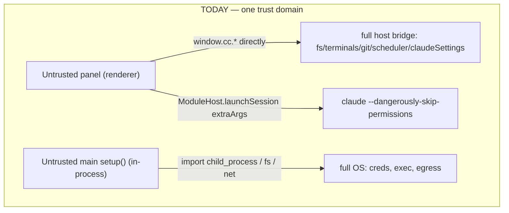
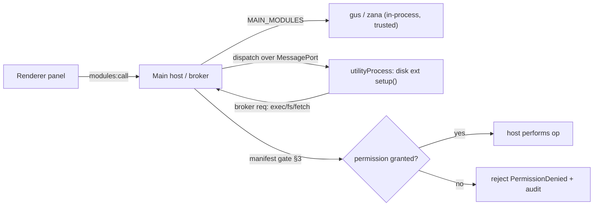
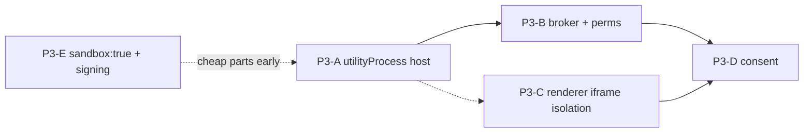

# Extensions Phase 3 — Trust Boundary: Architecture & Decision Spec

**Ticket:** P3-DESIGN · **Status:** design + decision doc (no code) · **Date:** 2026-06-12

**One-line:** Phases 0–2 shipped a *curated-trust* extension runtime — disk extensions are
discovered, their main module is `import()`'d **in-process with full Node**, and their panel is
blob-imported into the renderer where it can reach the **entire `window.cc` bridge**. Phase 3 is the
work that turns "extensions I vet" into "extensions anyone can publish." This spec grounds every claim
in the *current* code (post Phase 1/2 + SDK follow-ups), corrects the pre-Phase-1 findings where the
ground has moved, and ends with a **minimal-viable-trust-boundary** recommendation so the user can
decide how far to build before we write tickets.

This supersedes `docs/extensions-sdk-findings.md` **section C** as the implementation-grade security
plan. Section C remains the historical threat sketch; where they disagree, this doc is current.

---

## 0. What actually shipped (the surface we're securing)

Verified against current `main`:

- **Discovery** (`src/main/extensions/discovery.ts`): scans `~/.cc-center/extensions/<id>/extension.json`,
  validates the manifest (`validateManifest` :102), version-gates via `checkApiCompat`
  (:217), reads the enabled-map, and resolves `entry.main` / `entry.renderer` **contained within the
  extension dir** (`resolveContained`, :254 + :327). `permissions` are parsed and surfaced (:121-123,
  :148) but **never consulted**.
- **Main load** (`src/main/extensions/loader.ts`): `importMainModule` does
  `await import(pathToFileURL(mainEntryPath))` (:114-115), takes `default` as a `MainModule` after a
  structural `isMainModule` check (:53-57), and collects it.
- **Boot wiring** (`src/main/index.ts:1286-1296`): `loadExtensions()` → `moduleHost.setupAll([...MAIN_MODULES, ...modules])`.
  **Disk extensions and built-in gus/zana run through the identical host, in the same process, with the
  identical `MainModuleContext`.**
- **Host** (`src/main/modules/registry.ts`): `setupAll` :77 calls each module's `setup(ctx)` where
  `ctx = { storage, log }` (:79-82) — that is the *entire* sandbox today; the extension simply
  `import`s `node:child_process` / `node:fs` itself (gus :20, zana :35). `dispatch` :127 looks up the
  capability and calls it with **no permission check**. `teardown` :104 + `liveModuleIds` :122 exist.
- **IPC** (`src/main/index.ts`): `modules:call` :1016-1025 → `moduleHost.dispatch`; `modules:pushInbox`
  :1042-1058 → `inboxStore.append` (note: `_moduleId` is received but **ignored** :1045);
  `extensions:*` :769-810.
- **Renderer host** (`src/renderer/modules/host.ts`): every `ModuleHost` method is implemented by
  reaching `window.cc.*` directly — `launchSession` :152-165, `openExternal` :127-129, `pushInbox`
  :130-137, storage :122-125. `moduleId` is **closed over by the host factory** (:117), not asserted by
  the main process.
- **Renderer load** (`src/renderer/modules/loader.ts`): reads the panel JS via
  `window.cc.extensions.readRendererEntry` (:140), wraps it in a `Blob`, `import()`s the blob URL
  (:146), and `activate({ React, host })` (:159-161). The panel runs **in the main window's renderer**,
  same origin, same `window.cc`.
- **Window** (`src/main/index.ts:354-360`): `contextIsolation:true`, `nodeIntegration:false`,
  **`sandbox:false`**, `webviewTag:true`. `<webview>` children *are* hardened
  (:367-378: contextIsolation on, sandbox on, preload stripped, scheme allowlist).
- **CSP** (`src/renderer/index.html:5`): `default-src 'self'`; **`script-src 'self' 'wasm-unsafe-eval' blob:`**
  (the `blob:` is load-bearing for the panel loader); `connect-src 'self' data: blob:`;
  `frame-src http: https: about:` (broad — for the preview `<webview>`).

---

## 1. Threat model refresh vs. current code

A malicious disk extension (anyone who can write a dir into `~/.cc-center/extensions/`) gets **two
independent footholds**, either alone sufficient for full compromise:

### 1a. Main process — full RCE by install (the severe one)
`importMainModule` runs the extension's `default.setup(ctx)` **in the Electron main process**
(`loader.ts:114` → `registry.ts:84`). Main is unsandboxed Node. The `ctx` (`{storage, log}`) is
irrelevant to an attacker — they just `import('node:child_process').execFile(...)`, exactly as gus does
(`plugins/gus/main/gus-main.ts:20,103`). Concretely, at `setup()` time or inside any dispatched
capability the extension can:

- **Execute arbitrary processes** — `sf org display --json`, `aws sts get-session-token`, a reverse shell.
- **Read/write any file the user can** — `~/.ssh/id_*`, `~/.aws/credentials`, `~/.claude/`, the app's own
  config under `~/.cc-center/`, *other extensions' storage JSON* (storage is keyed by a self-declared id;
  see 1c).
- **Exfiltrate** — `fetch`/`net` to any host; there is no egress control in main.
- **Persist / tamper** — write a launchd plist, modify the app's files, schedule a task via the scheduler
  surface.

There is **no isolation, no allowlist, no timeout, no audit** on the main side. This is unconditional
arbitrary-code-execution the moment an untrusted extension is enabled. It is the single fact that makes
"open to third parties" unsafe today.

### 1b. Renderer panel — full `window.cc` reach (the broad one)
The SDK *says* the panel reaches the host "**only** through `ModuleHost` … no escape hatch to
`window.cc`" (`packages/extension-sdk/src/renderer.ts:8-10`). **That is a convention, not a control.**
The panel bundle is `import()`'d into the *main window's* renderer (`loader.ts:146`) which shares one
`window` with the shell. The bundle can ignore the injected `host` and type `window.cc.…` directly.
The full surface is `src/preload/index.ts` — the dangerous reachable bits:

- `window.cc.fs.writeFile` / `readFile` / `walkFiles` (:79-87) — arbitrary file R/W via the main handler.
- `window.cc.terminals.create` / `write` / `reply` (:38-43) — spawn/drive any terminal in any project.
- `window.cc.claudeSettings.write` (:172-176) — rewrite a project's `.claude/settings*.json` (e.g. add
  auto-approve permissions or a malicious hook).
- `window.cc.git.discard` (:94) — destroy uncommitted work.
- `window.cc.scheduler.create` (:206) — install a recurring agent task.
- `window.cc.mcp.setEnabled*` (:139-143), `window.cc.skills.setEnabled` (:179) — flip the user's tool config.
- `window.cc.modules.call(anyModuleId, …)` (:238) — **call another extension's capabilities** (cross-extension).
- `window.cc.modules.storageGet/Set(anyModuleId, …)` (:240-242) — **read/write another extension's storage.**

So even an extension with *no* main module is dangerous purely from its panel.

### 1c. `launchSession` `extraArgs` — the sharpest *renderer-reachable* main vector
`ModuleHost.launchSession({projectId, extraArgs, …})` (`host.ts:152`) calls `createTerminal(... {extraArgs})`
→ IPC `terminals.create` (`index.ts:516`) → `ptys.create({extraArgs})` (:536). The SDK doc itself says
extraArgs "**are appended last and so win over global/project defaults**" (`renderer.ts:158-162`). A panel
can therefore launch a Claude agent with `--dangerously-skip-permissions`, an attacker-controlled
`--mcp-config`, or a hostile system prompt, in any open project — an *auto-approving agent in the user's
repo*. This is reachable from the panel even without `window.cc` (it's a first-class `ModuleHost` method),
and from `window.cc.terminals.create` directly.

### 1d. Storage spoofing / id authenticity
Storage is namespaced by a **caller-supplied** moduleId on both sides: `window.cc.modules.storageGet(moduleId,…)`
(`preload:240`) → `moduleHost.storageGet(moduleId,…)` (`registry.ts:137`), and dispatch keys on the passed
`moduleId` (`registry.ts:127`). Nothing binds the call to the *authenticated* extension that made it. A
panel reads/writes any extension's namespace by passing its id. The renderer `host` closes over the right id
(`host.ts:117`) but that's cooperative, not enforced.

### 1e. What Phase 1-FIX already guards (don't re-solve)
- **Entry path-escape into main:** a manifest `entry.main` of `../../evil.js` is rejected — `resolveContained`
  refuses to set `mainEntryPath` (`discovery.ts:254-268`), so the loader can't `import()` outside the dir.
- **Renderer entry path-escape:** `readRendererEntry` re-checks containment (`discovery.ts:327-331`) and
  existence before returning JS.
- **Structural validation:** bad/missing/malformed manifest is skipped, never thrown (`validateManifest` :102,
  `discoverExtensions` :164); a non-conforming `default` export is rejected (`isMainModule` :53).
- **Per-extension failure isolation:** a throwing `setup()` disables only that module (`registry.ts:87-93`);
  a throwing panel renders an error surface, not a shell crash (`loader.ts:56-81`).
- **Version gate:** contract-incompatible extensions don't mount (`checkApiCompat`, `discovery.ts:217`).

These are real and reduce the *surface* (an extension can't load code from outside its dir), but they do
**nothing** about what the loaded-from-inside-the-dir code can then do. The trust boundary is still absent.



---

## 2. Main-process isolation

### 2a. The decision: `utilityProcess`, one per **untrusted** extension; built-ins stay in-process
Electron's `utilityProcess` is the native, supported primitive (a `ChildProcess` with a `MessagePort`,
no `BrowserWindow` baggage), and it mirrors VS Code's extension-host model. Alternatives considered and
rejected for *this* code:

- **`vm`/`vm2` in-process sandbox** — does not isolate `process`, native addons, or the event loop; CVE
  history; gives no crash isolation. Rejected.
- **`worker_threads`** — shares the process; a native module or `process.exit` takes the app down; not a
  security boundary. Rejected.
- **`child_process.fork` of a plain Node binary** — viable but you re-implement the lifecycle, IPC framing,
  and resource limits that `utilityProcess` gives you, and you lose the Electron-managed teardown on app
  quit. Rejected in favor of `utilityProcess`.

### 2b. CRITICAL decision — built-in gus/zana in-process, disk extensions out-of-process
**Recommendation: a two-tier host. Built-in `MAIN_MODULES` (gus, zana) stay in-process and trusted;
disk-discovered extensions each run in their own `utilityProcess`.** Rationale:

- gus/zana are shipped *with the app* and reviewed like core; isolating them buys ~zero security and costs
  a full rewrite of their direct `execFile`/`fs` usage (`gus-main.ts:103,146,190`; `zana-main.ts:92,250`)
  onto a broker. The findings doc's own DECISION (lines 11-21) already treats built-ins as "as trusted as
  core."
- The *threat* is **code arriving on disk from outside the build** — that, and only that, is what must be
  isolated. Tier on **provenance**, not on capability.
- An "all out-of-process" variant is cleaner conceptually but (a) forces the gus/zana broker migration now
  and (b) adds per-call IPC latency to first-party features for no trust gain. Defer "all OOP" to a later
  hardening pass if we ever want defense-in-depth on built-ins.

This is a small, explicit split in `setupAll`'s caller: `MAIN_MODULES` → in-process host (today's path);
`loadExtensions().modules` → never imported into main at all (see 2c — the loader stops `import()`ing).

### 2c. How `setup()` moves out-of-process
Today the *host* `import()`s the module (`loader.ts:114`). Under isolation the host **must not** import
untrusted code into main. Instead:

1. The host spawns `utilityProcess.fork(extensionHostEntry, [extensionDir], { … })` — `extensionHostEntry`
   is a **core-owned, trusted** bootstrap shipped in the app bundle, *not* extension code.
2. That bootstrap, *inside the child*, does the `await import(pathToFileURL(mainEntryPath))` and
   `default.setup(brokerCtx)`. The dynamic import that is `loader.ts:114-115` today moves verbatim into the
   child bootstrap.
3. The child has **no preload, no Electron `app`**, and runs with a constrained `execArgv`/env. It talks to
   the host only over the `MessagePort`.

The host keeps a `Map<extensionId, UtilityProcessHandle>` parallel to today's `caps`/`modules` maps.

### 2d. RPC / broker shape across the boundary
Define a tiny length-prefixed JSON-RPC over the `MessagePort` (one in-flight table keyed by a monotonic
`callId`). Two directions:

- **host → child:** `{type:'dispatch', callId, capability, args}` and `{type:'teardown'}`. `dispatch`
  resolves/rejects the renderer's `modules:call` — this is exactly today's `MainModuleHost.dispatch`
  (`registry.ts:127-135`) with the function-call replaced by a round-trip. Add a **per-call timeout**
  (reject + log if the child doesn't answer in N s) and a **concurrency cap**.
- **child → host (broker requests):** `{type:'broker', reqId, method, args}`. The child's `MainModuleContext`
  methods are *thin stubs* that post a broker request and await the reply. **The host is where every
  capability is checked against the manifest** (see §3). The child never gets a raw fd, socket, or
  `child_process` handle — only host-mediated results.

`MainModuleContext` grows from `{storage, log}` (`main.ts:24-32`) to add the brokered capabilities:

```
MainModuleContext (new, all async over the port):
  storage   // unchanged shape; host-side store, keyed by AUTHENTICATED id (§3d)
  log       // unchanged
  exec({ bin, args, cwd?, timeoutMs? })   // NO shell string; bin must be on the manifest's exec allowlist
  fs.readFile(path) / writeFile(path,data) / readdir(path)  // path canonicalized + scoped to granted roots
  fetch(url, init?)                        // host-side fetch; url host must be on the egress allowlist
```

Migration path for the contract: this is **additive** — existing `{storage, log}` keep working, so a
built-in that never touches the new fields is unaffected. Disk extensions that today `import('node:child_process')`
must move to `ctx.exec(...)`; since untrusted extensions can no longer `import` Node freely once they run in
a child that denies it (see 2e), this is *forced* rather than optional. The SDK `MainModuleContext` type
gains the new optional-at-type-level members and a doc note that they throw `PermissionDenied` unless the
manifest grants them.

### 2e. Constraining the child's ambient Node
A `utilityProcess` is still Node — `require('child_process')` works unless you stop it. Options, in
increasing strength: (a) **policy-only** (rely on review + the broker being the *easy* path) — weak;
(b) wrap the bootstrap in a `Module._load` shim that denies a denylist of built-ins (`child_process`, `net`,
`dgram`, `fs` write, `vm`) to non-core code; (c) Node's experimental permission model
(`--permission --allow-fs-read=<root>`) on the child's `execArgv` — strongest, OS-enforced fs/child-process
denial, but still maturing. **Recommend (b) now, evaluate (c) when stable.** Note this only matters once
you're loading *untrusted* code; for the curated set it's defense-in-depth.

#### 2e-LANDED (P3-HARDEN) — the denylist as built, and its honest residual
Option (b) shipped, generalized for the **ESM** child (`"type":"module"`), in
`src/main/extensions/host-child-guard.ts`, installed by `host-child.ts` *before* the untrusted `import()`.
The child is ESM, so a single `Module._load` shim is **not** enough — `import 'node:fs'` never goes through
`_load`. The implemented guard is therefore **three layers**, each closing one reach-path verified to be
exploitable:

- **L1 — ESM loader hook** (`module.register()` of a `data:` URL whose `resolve` throws on a denied
  specifier). Catches static AND dynamic `import` of a denied builtin across the whole untrusted module graph.
- **L2 — `Module._load` patch.** Catches CJS `require`, reachable from ESM via `module.createRequire(...)('fs')`
  — the loader hook does **not** see this path (verified). Also covers any transitive CJS dependency the ext
  bundles.
- **L3 — neutered `process.binding` / `process._linkedBinding`.** Closes the native-binding escape
  (`process.binding('spawn_sync')`), which bypasses both L1 and L2 (verified).

Denylist: `child_process, fs, fs/promises, net, dgram, http, https, http2, tls, dns, vm, worker_threads,
cluster, inspector, repl, v8, module` (each in bare + `node:` form). `module` is denied to *untrusted* code
too — the bootstrap's own `import 'node:module'` resolves before the hook registers, so denying it only
affects the ext graph and removes the reflective foothold of the live `Module` namespace (`_cache`,
`createRequire`). A well-behaved ext using only the broker `ctx` (exec/fs/fetch/storage/log over the port) is
unaffected — none of those touch a raw builtin in the child.

**HONEST RESIDUAL (do not overclaim a seal):** this is **JS-level capability deprivation in the same realm,
not an OS sandbox.** It is bypassable in principle by:
- **`process.dlopen`** — loading a native `.node` addon directly. Left in place deliberately (stubbing it
  risks breaking legit native deps; the pure-JS-ext threat it adds is exotic) — an **accepted** residual.
- a **realm/reflection escape** — JS-level guards run in the same realm as the ext; a sufficiently clever
  reflective path is not provably sealed.

So the bar moves from "trivial one-liner bypass" to "requires a native-addon or realm-escape exploit." The
**true** seal remains option (c) — Node's `--permission` model or an OS sandbox at spawn — still the
recommended follow-up when stable. This is the strongest *practical* mitigation without that OS boundary, and
it is honestly **not** a hard seal.

### 2f. Crash isolation, kill, timeouts, teardown
- **Crash isolation** is the headline win: a child segfault/`process.exit`/infinite loop no longer touches
  main. The host listens for the child's `exit`, marks the extension `mainActive:false`, surfaces it to the
  renderer (the `mainActive` plumbing already exists — `loader.ts:86-99`, `liveModuleIds` `registry.ts:122`),
  and optionally offers relaunch.
- **`teardown`** (`registry.ts:104`) maps to: post `{type:'teardown'}`, await with a short deadline, then
  **`handle.kill()`** unconditionally. This is strictly *better* than today's await-the-in-process-teardown,
  which can hang main.
- **Timeouts/limits:** per-dispatch timeout (above); a watchdog that kills a child exceeding wall-clock or
  (where available) memory; a restart-backoff so a crash-looping extension is disabled, not respawned forever.



---

## 3. Permission enforcement — turn the declared union into deny-by-default gates

Today `ExtensionPermission` (`index.ts:34-40`) is documentation. Phase 3 makes it the access-control list.
**Deny by default:** if a permission isn't in the manifest, the gate rejects. Gates live at two choke points.

### 3a. Main / broker boundary (the in-host gate)
Every broker request from a child is checked in the host against that extension's **manifest permissions**
before the host performs the op. Mapping (and the *new* permissions Phase 3 must add to the union):

| Capability | Permission (existing or **new**) | Where checked |
| --- | --- | --- |
| `ctx.exec({bin,…})` | **`exec`** + per-manifest `execAllowlist: string[]` of bin basenames | broker `exec` handler; reject if `exec` ungranted or `bin` not allowlisted; never accept a shell string |
| `ctx.fs.read*` | **`fs:read`** + `fsRoots: string[]` (canonicalized, scoped) | broker `fs` handler; `isWithin(canonical(path), grantedRoot)` (reuse `path-util.ts:15`) |
| `ctx.fs.write*` | **`fs:write`** + `fsRoots` | same, plus deny known-sensitive roots (`~/.ssh`, `~/.aws`, `~/.cc-center`) even if a root would cover them |
| `ctx.fetch(url)` | **`net`** + `egressAllowlist: string[]` of hosts | broker `fetch` handler; reject off-allowlist host |
| `storage` | `storage` (exists) | broker storage handler |

`bin` allowlist and `fsRoots`/`egressAllowlist` are **scoping data alongside the permission** — the manifest
declares not just "may exec" but "may exec `sf`". Storing them in the manifest keeps the consent screen (§5)
honest: the user sees *what* it may run/read/reach.

### 3b. Renderer `ModuleHost` boundary (the panel gate)
The dangerous panel methods must be gated against the **same** manifest. Because the renderer can't be
trusted to self-enforce (it's where the untrusted panel runs), the *authoritative* check is in **main**, on
the IPC handler, keyed by the authenticated extension id (§3d) — the renderer-side `host.ts` method just
forwards; main decides:

| `ModuleHost` method | IPC it rides | Permission | Notes |
| --- | --- | --- | --- |
| `launchSession` (`host.ts:152`) | `terminals.create` | **`session:launch`** (default OFF) | + `extraArgs` **denylist** (`--dangerously-skip-permissions`, `--mcp-config`, `--permission-mode`, `--append-system-prompt`, …), project-scoping, and **first-use confirmation**. See §1c. |
| `openExternal` (`host.ts:127`) | `openers.openIn` | `external:open` | reject non-http(s) schemes |
| `pushInbox` (`host.ts:130`) | `modules.pushInbox` | `inbox:push` | wire `_moduleId` (`index.ts:1045`) into attribution |
| `selectProject`/`listProjects`/`getActiveProject` | store/IPC | `projects:select` / `projects:read` | |
| raw `window.cc.fs/git/scheduler/claudeSettings/terminals.write` | direct bridge | — | **must be made unreachable from the panel** — see §4; gating alone can't fix a bridge the panel can call directly |

The table's last row is the crux: enforcing permissions on `ModuleHost` is necessary but **not sufficient**
while the panel can bypass `ModuleHost` and hit `window.cc` directly (§1b). §4 closes that.

### 3c. Where the gate physically lives
Add a single `PermissionBroker` in main: `can(extensionId, permission, scopeArg?) → boolean` driven by the
loaded manifest set (`extensionEntries` already held in `index.ts`). Call it: (1) in the `utilityProcess`
broker request handler (§3a), (2) in the `modules:call` dispatch (`index.ts:1016`) for capability-level
policy if desired, and (3) in each renderer-facing handler that a `ModuleHost` method rides (§3b). Reject →
throw `PermissionDenied` (re-thrown to the panel's `call()` like today's errors, `index.ts:1023`) + append an
**audit log** line (extensionId, permission, scope, allow/deny, ts) under `~/.cc-center/`.

### 3d. Anti-spoof: key everything by the AUTHENTICATED extension id
The id must come from **provenance, not the payload**:

- **Main/child:** the host *owns* the `extensionId↔utilityProcess` mapping; broker requests arrive on *that
  child's* port, so the id is the port's owner — the child can't forge it. Storage in the child's broker is
  keyed by that owner id, fixing §1d for disk extensions.
- **Renderer/panel:** harder, because all panels today share one `window.cc` and one IPC connection
  (`preload:238` passes `moduleId` as a plain arg). The robust fix is per-extension renderer isolation (§4) so
  each panel's IPC is attributable to its origin/world. **Interim** (if §4 is deferred): have the host issue a
  per-mount **capability token** to each panel at `activate` time (injected via the `host` object, not
  guessable), and require it on `modules.*` / gated IPC; main maps token→id. This is weaker than origin-based
  attribution (a panel could leak its token to another) but closes casual cross-extension storage/dispatch
  spoofing. Drop `moduleId` as a trusted arg in `modules.storageGet/Set` (`preload:240-242`).

---

## 4. Renderer hardening

### 4a. The `window.cc`-from-panel problem (the central renderer decision)
Three options, increasing cost:

1. **Accept-for-now (curated only).** Keep the panel in the main window; rely on review. Honest for a curated
   app; **disqualifying for untrusted** — §1b stands.
2. **Per-extension `<iframe sandbox>` + `postMessage` bridge.** Each panel renders in a sandboxed iframe
   (distinct origin, e.g. a custom `ext://<id>` scheme or `srcdoc`), with **no `window.cc`** — its only
   channel is a narrow `postMessage` RPC to the shell, which forwards to main *with the iframe's origin as the
   authenticated id* (fixes §3d cleanly). This is the VS Code webview model. Cost: the React-instance-sharing
   trick (`loader.ts:159` passing host `React`) **breaks** — an iframe is a separate document, so the panel
   must bundle its own React and talk only over `postMessage`; the SDK `RendererEntry.activate({React, host})`
   contract changes for isolated panels (host becomes a `postMessage` proxy, React is the panel's own). This is
   the **biggest single item** in Phase 3 and the one that actually makes panels safe.
3. **`<webview>` per extension.** Heavier than an iframe, separate process; the hardening path
   (`index.ts:367-378`) already exists for the preview pane. Overkill for a panel unless you want process
   isolation for the renderer too.

**Recommendation:** for untrusted, **option 2** (sandboxed iframe + postMessage bridge). It is the only
renderer change that both removes `window.cc` reach *and* gives origin-based id authentication. For
curated-only, option 1 is defensible and §4 can be deferred wholesale.

### 4b. CSP tightening
Current `index.html:5` already has no `unsafe-eval` for scripts and `default-src 'self'`. Gaps for untrusted:

- **`blob:` in `script-src`** is required by the current panel loader (`loader.ts:144-146`). If panels move
  to sandboxed iframes (4a-2) that load their own bundle from an `ext://` scheme, you can **drop `blob:` from
  the top-level `script-src`** and scope script execution to the iframe origins — a real tightening.
- **`frame-src http: https: about:`** is broad (for the preview webview). Once panels are iframed, scope
  `frame-src`/`child-src` to the `ext://` scheme + the preview need, not the whole web.
- **`connect-src 'self' data: blob:`** — fine; extension egress goes through the **main-side broker fetch**
  (§3a), not renderer `fetch`, so you do *not* widen `connect-src` per extension.

### 4c. Flipping `sandbox:true` on the main window
Today `sandbox:false` (`index.ts:358`). Turning it on runs the preload in a sandboxed context where Node is
unavailable in preload. **What breaks:** `src/preload/index.ts` imports only `electron` (`contextBridge`,
`ipcRenderer`, `webUtils`) and `../shared/ipc` (:1-2) — all sandbox-safe; `webUtils.getPathForFile` (:97) is
available under sandbox. There is **no `node:*`/`fs`/`path` import in the preload**, so flipping
`sandbox:true` is **low-risk** and should be done regardless of the iframe decision. Verify the build emits a
sandbox-compatible preload (electron-vite default) and that no future preload addition pulls Node. This is a
cheap, high-value hardening that doesn't depend on the rest of Phase 3.

### 4d. Cost/benefit for a curated app
- `sandbox:true` (4c): cheap, do it now.
- CSP scoping (4b): cheap *if* iframes land; otherwise marginal.
- iframe isolation (4a-2): expensive (SDK contract change for panels, React-sharing removed, postMessage RPC,
  every built-in/curated panel must keep working through the new path). Only pays off when admitting untrusted
  panels. **This is the line item to consciously defer for curated-first.**

---

## 5. Install-time trust

Cheap → strong, all deferrable until the moment you admit a non-vetted extension:

1. **SHA-256 pinning (cheap, do early).** On install, record the hash of each entry bundle; on load, re-hash
   and refuse on mismatch (catches post-install tampering of `~/.cc-center/extensions/<id>/dist/*`). Slots
   cleanly next to discovery's existing per-extension validation (`discovery.ts:164`).
2. **Publisher signing — TOFU (fine for solo-dev).** Extension signs its bundle; on first install the app pins
   the publisher key (trust-on-first-use); later updates must verify against the pinned key. No central CA, no
   marketplace. Good cost/strength fit for this app.
3. **Consent screen rendering declared perms (the user-facing gate).** Before first enable, show a
   plain-language screen built from the manifest `permissions` + their scoping (`execAllowlist`, `fsRoots`,
   `egressAllowlist`): "GUS wants to: run `sf`; read `~/work`; reach `gus.my.salesforce.com`." The data already
   exists in the manifest (`discovery.ts:121-123`); this is rendering + a stored grant.
4. **Re-prompt on widening (important).** On update, diff new permissions/scopes against the stored grant; if
   it **widens**, re-prompt and withhold the new capability until accepted. A narrowing or equal update is
   silent. Prevents the "benign v1, malicious v2" supply-chain move.
5. **Curated marketplace — skip.** Out of scope; not needed for solo-dev distribution.

**Pragmatic-now vs deferred:** consent screen (3) + perm-diff (4) are the must-haves the moment you open up,
because they're what convert §3's enforcement into *informed* user consent. Hash pinning (1) is cheap enough
to do alongside. Signing (2) can follow once there's a second author.

---

## 6. Phasing — ordered, implementable tickets

Each step preserves backward-compat: built-in gus/zana (in-process), the in-repo dogfood path, and any
curated disk extension must keep working at every step. MUST = required before calling the platform "safe for
untrusted"; NICE = defense-in-depth / polish.

| Ticket | Scope | Key risk | For untrusted |
| --- | --- | --- | --- |
| **P3-A · `utilityProcess` extension host** | Two-tier host: keep `MAIN_MODULES` in-process; spawn one `utilityProcess` per disk extension; move the `import()`+`setup()` (`loader.ts:114`) into a core-owned child bootstrap; JSON-RPC over `MessagePort`; map `dispatch`/`teardown`/`liveModuleIds`/`mainActive` onto it; crash/exit handling + kill + per-call timeout. | RPC framing + lifecycle bugs; latency; ESM-import-in-child caching. Backward-compat: built-ins untouched; a disk ext with only `{storage,log}` works unchanged. | **MUST** (removes §1a RCE) |
| **P3-B · Broker + deny-by-default permissions** | `MainModuleContext` += `exec`/`fs`/`fetch` brokered stubs; `PermissionBroker.can()`; manifest gains `execAllowlist`/`fsRoots`/`egressAllowlist`; gate broker requests (§3a) and the renderer-facing IPC for `launchSession`/`openExternal`/`pushInbox` (§3b); audit log; storage keyed by authenticated child id (§3d). Add new perms to the union (`exec`,`fs:read`,`fs:write`,`net`). | Migrating disk-ext authors off raw Node; getting the `launchSession` `extraArgs` denylist complete; canonicalization correctness (reuse `path-util.ts`). | **MUST** (closes §1a/§1c/§1d main side) |
| **P3-C · Renderer panel isolation** | Sandboxed-iframe panels + `postMessage` bridge; origin-as-authenticated-id; SDK `RendererEntry` path for isolated panels (own React); make `window.cc` unreachable from panels; tighten CSP `script-src`/`frame-src`; keep built-in/curated panels working through the new path. | Biggest item; React-sharing removed; every panel must be re-validated; UX of an iframed panel. | **MUST** (closes §1b + completes §3d renderer side) |
| **P3-D · Install-time consent** | Consent screen from manifest perms+scopes; stored grant; perm-diff re-prompt on widen; SHA-256 bundle pinning. | Consent fatigue; correct widen-detection. | **MUST** (informed consent for §3) |
| **P3-E · Hardening polish** | `sandbox:true` on main window (cheap — §4c, can ship anytime); Node-built-in denylist shim in the child (§2e-b); publisher signing/TOFU; watchdog memory limits; restart-backoff. | Low; mostly independent. | NICE (defense-in-depth) — except `sandbox:true` which is cheap-now |

Suggested order: **P3-A → P3-B → P3-C → P3-D**, with the cheap parts of **P3-E** (`sandbox:true`) pulled
forward to land independently and early. P3-A and P3-B are tightly coupled (the broker only matters once code
is out-of-process). P3-C is separable and is the largest; it can proceed in parallel once the SDK contract
change is agreed.



---

## 7. Explicit scope recommendation

**Two honest end-states.** Pick before we write P3 tickets.

### Option MIN — "safe enough for untrusted *main code*, panels stay curated"
Ship **P3-A + P3-B + P3-D**, plus `sandbox:true` from P3-E. Defer **P3-C** (renderer iframe isolation).

- **What this buys:** the severe vector — in-process RCE via `setup()` (§1a) — is gone; main-side capabilities
  are deny-by-default and consented; `launchSession`/exec/fs/fetch are brokered and scoped; crash isolation;
  informed install consent.
- **What it does NOT cover:** a malicious **panel** can still reach `window.cc` directly (§1b) and spoof
  cross-extension ids in the renderer (§3d interim token only). So under MIN, **panels must remain curated** —
  you can admit untrusted *main/headless* extensions and untrusted *capabilities*, but not untrusted *UI*.
- **Cost:** P3-C (the expensive, contract-breaking item) is avoided. This is the **minimal viable trust
  boundary** and the recommended first build for a solo-dev curated-first app: it removes the only
  unconditional RCE and gives real, enforced, consented permissions, while explicitly keeping the renderer a
  trusted tier.

### Option FULL — "safe for fully untrusted third parties, UI included"
All of **P3-A…P3-E**, including **P3-C**. Required if you ever let strangers ship *panels*. The dominant cost
is P3-C: the SDK panel contract changes (no shared React; postMessage host proxy) and every existing panel —
built-in and curated — must be ported and re-tested.

### Recommendation
**Build Option MIN now.** It is the right-sized boundary for curated-first: it kills the catastrophic
in-process RCE, makes the declared permissions real and consented, and isolates crashes — at a fraction of the
cost of P3-C. Treat **P3-C as a distinct, later "open the UI to strangers" milestone**, gated on actual demand
for third-party panels. Pull `sandbox:true` forward immediately (it's nearly free and unblocks nothing). Keep
gus/zana in-process throughout.

If the user's intent is genuinely "anyone publishes a full extension including UI," then FULL is mandatory and
P3-C should be scoped first because it's the long pole — but for the stated solo-dev curated-first posture,
MIN is the pragmatic line.

---

### Appendix — primary evidence index
- In-process main load: `src/main/extensions/loader.ts:114-115`, boot wiring `src/main/index.ts:1286-1296`,
  `setupAll` `src/main/modules/registry.ts:77-95`, ctx `packages/extension-sdk/src/main.ts:24-32`.
- Panel → full bridge: `src/preload/index.ts` (fs :79-87, terminals :38-43, claudeSettings :172-176,
  git :94, scheduler :206, modules :238-242); panel load `src/renderer/modules/loader.ts:140-161`;
  "no escape hatch" convention `packages/extension-sdk/src/renderer.ts:8-10`.
- `launchSession`/extraArgs: `src/renderer/modules/host.ts:152-165` → `src/main/index.ts:516-540`
  (extraArgs :536); doc "appended last and so win" `packages/extension-sdk/src/renderer.ts:158-162`.
- Storage spoof: `src/preload/index.ts:240-242`, `src/main/modules/registry.ts:127,137-143`.
- Phase 1-FIX guards: `src/main/extensions/discovery.ts:254-268,327-331`, `path-util.ts:15-28`,
  `isMainModule` `loader.ts:53-57`.
- Window/CSP: `src/main/index.ts:354-360` (`sandbox:false`), webview hardening :367-378,
  `src/renderer/index.html:5`.
- Built-ins to keep in-process: `plugins/gus/main/gus-main.ts:20,103,146,190`,
  `plugins/zana/main/zana-main.ts:35,92,250`; registry `src/main/modules/index.ts`.
- Declared-not-enforced perms: `packages/extension-sdk/src/index.ts:34-40`,
  `packages/extension-sdk/src/renderer.ts:277-283`.
