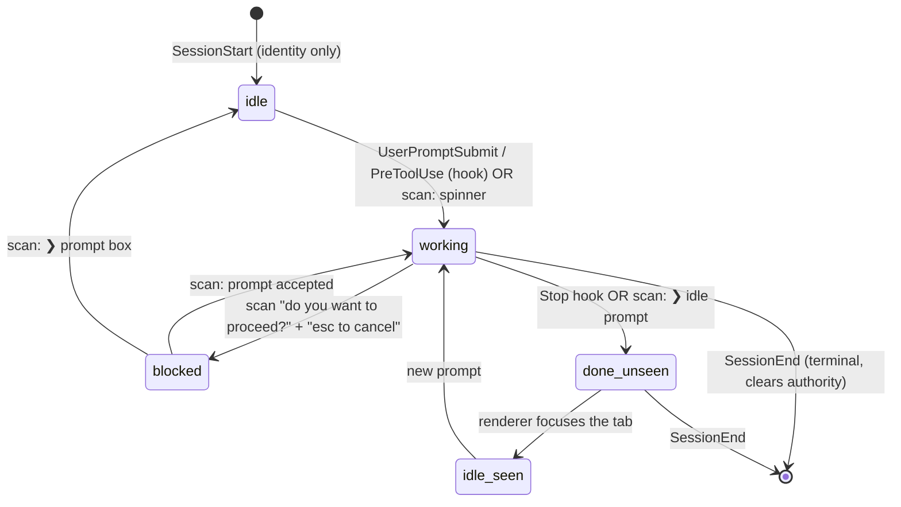

# Live Agent Status Awareness — Implementation Plan

**Status:** planned (designed 2026-06-10 via Zana arch council)
**Council verdict:** APPROVE WITH CONDITIONS (3× CHANGES → unanimous "build it this
specific way"; voters: security-reviewer, performance-engineer, researcher)
**Inspiration:** `herdr` (Rust TUI multiplexer), `~/Documents/claude-workspace/herdr`

---

## One-line

Show a live per-tab agent state — 🔴 blocked / 🟡 working / 🔵 done-unseen /
🟢 idle — across every project, rolled up to the project/sidebar so you can scan
the whole fleet at a glance, with tab-aware notifications when an agent finishes
or needs you.

## Why it's worth doing

Our README already promises "manage Claude Code sessions across many projects …
at a glance," but `TerminalSession.status` is only `starting | running | exited`
(`src/shared/types.ts:94`) — there is no awareness layer. This is the single
biggest capability `herdr` has that we lack, and we are unusually well-positioned:
the per-session hook callback channel already exists (`buildStopHookSettings()` in
`src/main/pty.ts:563`, callback server in `src/main/mcp-server.ts`). The hard
plumbing is built; this feature is mostly wiring + a detection layer.

---

## THE LOAD-BEARING DECISION (do not re-derive)

**Detection is screen-scan-PRIMARY, hooks are ADVISORY.** This reverses the
initial instinct (hook-primary).

The council's researcher seat verified against herdr's source that herdr **tried
Claude lifecycle-state hooks in versions 1–4 and deliberately removed them in v5**
(`herdr/src/integration/mod.rs:1374-1433`). herdr's `full_lifecycle_hook_authority()`
(`herdr/src/detect/mod.rs:231-241`) lists pi/omp/hermes/opencode/kilo/kimi as
hook-authoritative but **pointedly excludes `herdr:claude`** — for Claude, the
screen-scan in `claude.toml` is the authority. The recorded reason: Claude emits
`SubagentStop` *after* the main turn already stopped, so a naive
`PostToolUse`/`SubagentStop → working` mapping wrongly revives an idle pane.

**Therefore:**
- **Screen-scan (ported from `herdr/src/detect/manifests/claude.toml`) is the
  authority** for `blocked` / `working` / `idle`.
- **Hooks are latency-reducers + identity only**: `UserPromptSubmit`/`PreToolUse`
  → accelerate `idle→working`; `Stop` → confirm/stamp `done`; `SessionStart` →
  session identity. They never *override* a screen-derived state, except to push
  `idle→working` faster and to stamp `done` on a prompt-parked **scheduled**
  session that never repaints.
- **`blocked` comes from screen-scan ONLY**, never from the `Notification` hook
  (unverified that Claude even fires it on permission prompts).

### Signal fusion — three detectors, by cost (this is how "idle" is actually decided)

There is no signal that *says* "idle". We infer it. Three detectors, cheapest first:

1. **OSC title / progress (LAS-07b) — primary `working` signal, near-zero cost.**
   Claude writes a braille spinner `⠋⠙⠹…` (`U+2800–U+28FF`) into the terminal title
   while working and `✳` (`U+2733`) when idle/done. We parse it **from the raw PTY
   byte stream in `pty.ts.onData`** (`\x1b]0;…\x07` / `\x1b]9;4…`) — no xterm, no
   serialize, no renderer round-trip. **Works for hidden/unfocused tabs**, which
   herdr cannot do (it reads the *rendered* title).
2. **Buffer screen-scan (LAS-07) — authority for `blocked` + `idle`.** Slice the
   bottom region (prompt-box body between the last two `───` borders) and match the
   `claude.toml` rules: `❯` empty prompt with no question on screen = `idle`;
   "do you want to proceed?" + "esc to cancel" = `blocked`. Gated hard (visible tab,
   no-OSC sessions, debounced — see LAS-09).
3. **Hooks — `done` truth + idle-veto.** `Stop` is an authoritative "turn ended"
   (we already POST it). `PreToolUse` without a following `PostToolUse`/`Stop` means
   **a tool is in flight** → we *veto* any screen-derived `idle` during a quiet
   moment (a long silent tool call looks exactly like idle on screen). The veto is
   the enhancement that makes our `idle` strictly more accurate than herdr's
   screen-only debounce, which can only delay a false idle, not know it's false.

**"idle" = the `❯` prompt box is showing, no question on screen, OSC title is not a
spinner, AND no tool is in flight — held stable for one debounce window (~300 ms).**

### Where we beat herdr (we launch Claude; herdr only watches the screen)

| Signal | herdr | Us |
|---|---|---|
| OSC title spinner | rendered title only (visible panes) | **raw PTY stream → all tabs incl. hidden** |
| Tool in-flight (idle-veto) | ❌ can't know — only debounces | ✅ `PreToolUse`/`Stop` give ground truth |
| "turn ended" (`done`) | guessed from screen | ✅ `Stop` hook is authoritative |
| Stabilization debounce | ✅ 3-scan / 700 ms cap | ✅ adopt verbatim (LAS-08) |

### State machine

Hook-event → state mapping (verified against herdr unless noted):

| Hook event       | Use                              | Notes |
|------------------|----------------------------------|-------|
| `SessionStart`   | identity only; treat as `idle`   | herdr v5 uses it only for session_id |
| `UserPromptSubmit` | accelerate `idle→working`      | advisory |
| `PreToolUse`     | accelerate `idle→working`        | advisory; **coalesce** (fires per tool call) |
| `PostToolUse`    | **ignore**                       | removed in herdr v5; not authoritative |
| `Notification`   | **ignore for blocked**           | NEEDS RUNTIME CONFIRMATION; blocked = screen-scan |
| `Stop`           | confirm/stamp `done-unseen`      | we already POST this (`pty.ts:575`), guarded by `stop_hook_active` |
| `SubagentStop`   | **ignore — verified hazard**     | fires after turn end; would revive idle pane |
| `SessionEnd`     | terminal: clear authority        | treat as terminal even if `Stop` never arrived (e.g. `/exit`) |

### Rollup priority (confirmed vs `herdr/src/workspace/aggregate.rs:66-74`)

`max` over a project's sessions:
`Blocked (4) > Idle-unseen/done (3) > Working (2) > Idle-seen (1) > Unknown (0)`.
**done-unseen outranks still-working** — a finished-but-unread agent should pull
attention over one still grinding.

---

## Architecture constraints (binding — from the council)

### Store / IPC shape (performance)
- Status lives in a **dedicated `agentStatus: Record<sessionId, AgentState>` store/
  slice — NOT on the `TerminalSession` objects in `terminals`.** Routing status
  through `terminals.onUpdated` (`src/renderer/store.ts:750-766`) rebuilds the
  project session array + the whole `terminals` map and re-renders `ListPane`
  (:117), `TerminalSurface` (:20), and `useRunningSchedulerCount` (:1504) on every
  tick — a render storm.
- Status dots subscribe **by id to a primitive** (`useAgentStatus(s => s.byId[id])`).
- Per-project rollup is **precomputed imperatively** (O(1) amortized) inside the
  same store as a plain `Record<projectId, AgentState>`, read as a primitive.
  Do **not** compute it in an inline selector returning a fresh object/array —
  that hits the documented zustand infinite-loop trap (see MEMORY
  `zustand-selector-stable-ref`).
- New **`onAgentStatus(sessionId, state)` IPC channel** — do not overload
  `onUpdated`.
- **Main-side coalescing**: collapse `PreToolUse` spam to a single `working`,
  debounce emits to ~250–500 ms per session.

### Screen-scan gating (performance + security)
- Only sessions with **no hook coverage**, only the **focused/visible** tab,
  triggered by a **debounced PTY-quiet** signal (~300–500 ms).
- Serialize **only the bottom region** (after last horizontal rule / bottom ~3
  non-empty lines) — never the full 5000-line scrollback (`TerminalView` :67).
- Cap to **single-digit Hz** per visible session; use herdr's **3-scan
  working→idle debounce**.
- **Never persist/log/transmit raw buffer text**; emit only the derived enum.
  The matched substring must not ride along in the status update.

### Channel security (security-reviewer)
- **Per-session bearer token** (a second random secret, distinct from the session
  id) minted at spawn, baked into `CC_HOOK_URL`; reject POSTs whose token doesn't
  match the live session. The session id leaks in env + scrollback, so it is a
  routing key, not auth.
- **Validate liveness + project ownership** in the route handler
  (`ptys.has(projectId, sessionId)`); drop POSTs for unknown/exited sessions.
- Injected hook commands are **env-referencing only** — never interpolate event
  payload (tool name, prompt text) into the `sh -c` command line.

### Cross-cutting / regression protection
- Encode the lifecycle event name in the **URL path**
  (`/hook/event/:proj/:sid/:event`), not the body — the body is drained via
  `req.resume()` (`mcp-server.ts:192`) and discarded.
- Stamp a **spawn-generation/sequence** so stale POSTs from recycled ids are
  ignored.
- **Do NOT replace or re-key the existing `/hook/stop/...` route.** The scheduler's
  done-detection + auto-close depend entirely on it reaching
  `onStopHook → onAgentFinished` (`scheduler.ts:664-694`). Add lifecycle as a NEW
  route that *also* drives that path.
- **Compose ALL `--settings` consumers** — live-status hooks, scheduler Stop hook,
  parked Personas — into ONE merged settings JSON via a shared `composeSettings()`
  helper. Claude takes a single `--settings` (last-occurrence-wins clobbering,
  documented at `pty.ts:184-186`); stacking flags silently drops the scheduler
  hook and collides with Personas.

---

## Phases

### Phase 0 — De-risk (runtime confirmation, ~½ day) — **BLOCKS hook work**
Empirically confirm two things the council flagged as assumed, before locking design:
1. Does Claude emit a `Notification` hook on **permission prompts** (vs only
   idle-timeout)? Determines whether the hook path can ever contribute to `blocked`
   (default assumption: no — blocked stays screen-only).
2. Exact `--settings` merge/clobber behavior of the installed Claude binary
   (single flag, last wins) — validates the `composeSettings()` requirement.

### Phase 1 — Foundation, no UI (the safe substrate)
- `composeSettings()` helper; migrate the existing Stop hook + scheduler onto it
  (regression-guarded — auto-close must still work).
- Per-session bearer token + generation seq in spawn env; harden the callback
  route (liveness + ownership + token validation).
- New `/hook/event/:proj/:sid/:event` route that drives a state reducer **and**
  still feeds the scheduler done path.
- `AgentState` type; main-side per-session state store with coalescing/debounce;
  `seen` flag on `TerminalSession`.

### Phase 2 — Detectors (OSC fast-path + screen-scan authority)
- **LAS-07b first**: OSC-title/progress detector parsed from the raw PTY stream in
  `pty.ts` — the cheapest, highest-value `working`/`done` signal, works for hidden
  tabs. Ship this and a dot can already light up before any buffer scan exists.
- Port `claude.toml` rules → a TS detector over the xterm buffer bottom region
  (authority for `blocked` + `idle`).
- 3-scan working→idle debounce, content-change skip, startup grace window.
- Gated cadence wiring in `TerminalView`/`TerminalSurface`.
- Hybrid resolver with **hook idle-veto**: screen-scan authoritative; OSC title is
  primary `working`; a `PreToolUse` with no closing `Stop`/`PostToolUse` vetoes a
  false `idle` while a tool is in flight.

### Phase 3 — Renderer: dots + rollup
- Dedicated `agentStatus` store; `onAgentStatus` IPC bridge.
- Per-tab status dot (`TabBar`); per-project rollup dot (`ListPane`/`Sidebar`).
- `seen` flips on focus.

### Phase 4 — Notifications
- Tab-aware suppression (no toast for the focused/visible session) + per-session
  rate-limit/coalesce, reusing `Toaster`/inbox.

### Phase 5 — Polish & docs
- Settings toggle (enable/disable, sound), theming of dots, docs, edge-case tests.

See `docs/live-agent-status-tickets.md` for the per-ticket breakdown.
