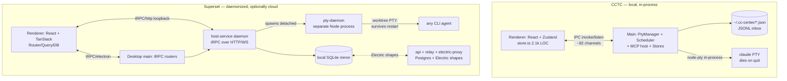

# Superset vs. CCTC — Architecture Comparison

> Analysis refreshed 2026-06-12 (deep pass, file:line-verified against both repos).
> Compares this project (Claude Code Terminal Center, "CCTC") against
> [Superset](https://github.com/superset-sh/superset) — an Electron desktop app for
> orchestrating CLI coding agents. Both run CLI coding agents over real PTYs, but sit at
> opposite ends of the scope/maturity curve. Superset is at v1.12.5 and very actively
> developed; CCTC is v0.4.0, single-developer.

## TL;DR

| | **CCTC (ours)** | **Superset** |
|---|---|---|
| **Thesis** | Command-center for **Claude Code** sessions across projects | Orchestrate **swarms of any CLI agent** in parallel, solo or as a team |
| **Scale** | 118 files, ~32k LOC, 1 npm package (+ `packages/extension-sdk`) | Monorepo: **10 apps + 22 packages**, Bun + Turbo |
| **Isolation unit** | Terminal tab per project (**shared cwd**) | **Git worktree per task** (isolated branch + dir, outside the main checkout) |
| **Agents** | 4 hardcoded Claude profiles (`shell`/`claude`/`claude-resume`/`claude-yolo`) | **10 built-in presets** (claude, amp, codex, gemini, copilot, cursor-agent, droid, opencode, mastracode, pi) + user-defined; a preset is just a data row |
| **Backend** | Local-only (`~/.cc-center/*.json` + JSONL inbox) | Local SQLite **mirror** ↔ cloud Postgres via **Electric SQL** shapes; optimistic TanStack DB; relay tunnel for remote hosts |
| **Terminal runtime** | In-process `PtyManager` in Electron main | **Standalone PTY daemon** (separate Node process) with **fd-handoff** — terminals survive app restart *and* binary upgrade with live scrollback |
| **IPC** | Hand-maintained channel enums (~82 channels) + generic `modules:call` | **tRPC over Electron IPC** (superjson, Sentry middleware) — end-to-end typed, zero channel registry |
| **Editor** | Monaco + monaco-vscode workbench | CodeMirror + TipTap + custom diff viewer |
| **Layout** | Fixed `{single, vertical, horizontal, grid}` enum, 3 slots | **Serializable recursive binary tree** (`packages/panes`) — arbitrary nesting |
| **Extensibility** | `@cctc/extension-sdk` (compile-time bundled plugins today) | Stainless-generated SDK + reusable CLI framework + filesystem slash-commands; MCP **server** |
| **Differentiators** | Inbox · Scheduler · Live Agent Status · Saved/Library · MCP host · deep Claude lifecycle | Worktree mgmt · multi-agent · cloud team sync · port detection · panes |

## Architecture, side by side

The deepest structural difference: **Superset decouples the terminal runtime into a
separate daemon, and isolates every task in its own git worktree.** CCTC keeps PTYs inside
the Electron main process and runs agents in the project's shared cwd. Superset's model is
dramatically more robust and parallel-capable; CCTC's is dramatically simpler.

## What we could learn from Superset

### 1. Git-worktree isolation — the biggest conceptual gap
Superset's core primitive is `project → worktree → branch`. A new task runs **one tRPC
mutation** (`workspacesRouter.create`, ~1,100 lines) that: prunes stale worktrees, forks a
branch from the *upstream* of the default branch (not stale locals), namespaces + dedups the
branch name, `git worktree add`s into `~/.superset/worktrees/<project>/<branch>` (deliberately
*outside* the main checkout), registers it across git + cloud + local SQLite with
**compensating-action rollback** on any failure, then spawns the agent with its **cwd set to
the worktree**. It can also **adopt** a pre-existing worktree from 4 entry points (idempotent),
and marks user-created ones `createdBySuperset: false` so it never deletes them.

We run agents in the project's shared cwd, so two Claude tabs in one project step on each
other. **This is the single most valuable idea to borrow** for true *parallel* agents — but
be honest about the cost: it's not "run `git worktree add`." The moat is the create/adopt/
rollback **saga** and its failure paths (don't orphan disk, keep state retryable, verify
against git's own `worktree list` registry not exit-code text). Those ~1,500 lines encode
production bug fixes (the comments cite issue numbers). It also forces a daemon (N parallel
agents must outlive any window) and port observability (N worktrees = N dev servers).

### 2. Agent abstraction via presets — cheap to copy, high value
`HostAgentPreset = {presetId, label, description, command, args[], promptTransport, promptArgs[], env{}}`
(`packages/shared/src/host-agent-presets.ts`). `promptTransport` is a deliberately tiny enum:
**`"argv" | "stdin"`** — the prompt is appended as the final argv positional, or piped via a
heredoc with a collision-proof delimiter. Empty prompts drop `promptArgs` so promptless
launches don't get stray flags. 10 presets ship; users can add fully custom ones. **Adding a
new agent is a data edit, no code.** This is ~70 lines of shared code + a CRUD router — the
*one* big idea here that's matchable **without** any worktree machinery, and it aligns with
our parked Personas work ([[personas-roadmap-parked]]). Our `LaunchProfileId` is a hardcoded
4-value Claude union; a preset table generalizes it without discarding the Claude-specific
`resolveLaunch` layering.

### 3. tRPC over IPC — pure correctness/DX win, low cost
We hand-maintain ~82 channel string literals in `src/shared/ipc.ts` + a generic
`modules:call` dispatch; adding a channel is a multi-file edit with no compile-time guarantee
main and renderer agree. Superset builds one `AppRouter` whose **type** is inferred via
`ReturnType<typeof createAppRouter>`, bridged with `trpc-electron` + superjson, so a renamed
procedure is a renderer compile error. A Sentry middleware wraps every procedure (reports only
`INTERNAL_SERVER_ERROR`, skips expected user errors). **Caveat we'd hit:** `trpc-electron`
requires subscriptions to be **RxJS `observable`**, not async generators — it checks
`isObservable()` and the async-gen path silently never fires. This is independent of the
daemon — we could adopt it alone for a big win.

### 4. Panes as a serializable binary tree
`packages/panes` models splits as a recursive `LayoutNode` (`pane | split{direction, first,
second, splitPercentage}`), with pane *data* in a flat `Record<id, Pane>` map keyed off the
leaves. Every op (split, resize, equalize, **graft a whole tab's subtree onto a pane**) is one
recursive function. Ours is a fixed `{single,vertical,horizontal,grid}` enum with a 3-slot
array (`SPLIT_CAPACITY`) — fine today, but a tree generalizes cleanly if we ever want
arbitrary nesting. (Their split UI is also actually shipped; ours is gated off behind
`SPLIT_UI_ENABLED = false`.)

## What CCTC does that Superset doesn't (our moats)

Genuinely **ours** — Superset has no equivalent:

- **Inbox** — agents push docs/comments to a Linear-style surface via the `inbox_push` MCP
  tool (`src/main/inbox-store.ts`, `inbox-mcp-tool.ts`), now with **silent/quiet/loud**
  per-schedule notification levels baked onto the session at spawn. Superset has no
  agent→human async channel like this.
- **Scheduler** — in-process cron (`src/main/scheduler.ts`, 727 LOC): run history with
  retention clamp, auto-close-on-finish via Stop hooks, notify-on-finish. (Tradeoff: fires
  only while the app is alive — no OS cron/daemon.) Superset has an `Automations` SDK resource
  but nothing this turnkey locally.
- **Live Agent Status** — OSC-title fast path **fused** with a Notification-hook overlay to
  distinguish `idle` / `working` / `blocked` (`src/main/agent-status.ts`); the hook is the
  *only* reliable "blocked, waiting on user" signal. Superset tracks coarser
  running/exited/needs-attention.
- **MCP server host** + Saved Reports + a full **document Library** (with idea/brainstorm
  capture) — an agent-artifact lifecycle Superset doesn't have. (Note: Superset's `mcp`/
  `mcp-v2` make it an MCP *server* exposing its own resources to agents — the inverse role.)
- **Deep Claude Code integration** — `resolveLaunch` + `createTerminal` layer a precise
  precedence stack: base profile → global args → `--mcp-config` → `--append-system-prompt`
  (inbox + schedule guidance) → project settings (model, tools, permission-mode) → Stop/
  Notification hook injection → per-tab extraArgs, with per-session callback URLs baked into
  env. Superset is deliberately agent-agnostic and therefore shallower per-agent.

The two products converge from opposite ends: **Superset = breadth** (many agents,
parallelism, cloud teams), **CCTC = depth** (rich Claude lifecycle, scheduling, async inbox).

## Things to be wary of copying

- **Their PTY daemon is a large, ongoing tax.** fd-handoff reaches into node-pty's private
  `_fd` (pinned + asserted), the mode signal must be `--handoff` argv not env (bundler DCE
  strips env branches — they ship a post-build grep canary), node-pty forces a Node runtime
  while Bun is the build tool, adopted PTYs need an `stty`-via-fd resize shim and PID-poll exit
  detection, and the handoff has real socket-unlink/bind races + a crash-loop circuit breaker.
  Worth it only if surviving restart/upgrade with **live scrollback** is a real requirement.
  Our re-spawn-with-`--continue` (scrollback lost by design) is a deliberate simplification.
- **Their full cloud stack** (Postgres + Electric SQL + electric-proxy + relay tunnel + Better
  Auth + Stripe) is a heavy bet on multiplayer/teams. Our local-only `~/.cc-center` JSON model
  is a deliberate simplicity advantage — don't trade it away unless we actually want team sync.
- **Bun + Turbo monorepo** makes sense at 30+ packages; at our single-package scale it'd be
  premature.
- **Breadth costs depth** — by supporting every CLI agent they can't do the Claude-specific
  hook/status/MCP tricks we do.

## Prioritized takeaways

Three concrete, proportionate moves, smallest-cost-first:

1. **Generalize `LaunchProfileId` → a preset table** (`{command, args, promptTransport, env}`).
   Lowest risk, aligns with parked Personas, ~the only big Superset idea that's cheap to lift.
2. **Evaluate `trpc-electron`** to replace the hand-maintained IPC registry — pure DX/
   correctness win, independent of everything else. (Mind the RxJS-observable subscription rule.)
3. **Worktree-per-session** as an opt-in launch mode — unlocks safe parallel agents, but it's
   the expensive one (saga + likely a daemon + port detection). Only if parallelism becomes a
   real goal.

## Reference: Superset structure

- **Apps (10):** `admin` (internal dashboard), `api` (Next.js + tRPC + Neon Postgres, hosts the
  v2 MCP server, Stripe/billing), `desktop` (the Electron app), `docs` (Fumadocs), `electric-proxy`
  (Cloudflare Worker auth-gating Electric shapes), `marketing`, `mobile` (Expo), `relay`
  (Bun/Hono WS tunnel to remote hosts, on Fly + Redis), `streams` (stub), `web` (Next.js dashboard).
- **Packages (22):** `auth` (Better Auth + Stripe), `chat` (Mastra agent runtime), `cli`,
  `cli-framework` (reusable command framework w/ build-time discovery), `db` (Drizzle/Postgres),
  `local-db` (better-sqlite3 mirror), `email`, `host-service` (the host daemon: git + PTY +
  workspaces + agent launch), `pty-daemon` (standalone PTY process w/ fd-handoff), `panes`
  (binary-tree splits), `mcp` / `mcp-v2` (MCP server, v2 is a rewrite ~23 tools), `sdk`
  (Stainless-generated `@superset_sh/sdk`), `shared` (presets, types, rrule), `trpc`, `ui`
  (shadcn + Tailwind v4), `workspace-client`, `workspace-fs` (virtual FS + @parcel/watcher),
  `port-scanner`, `macos-process-metrics` (native C++ addon).
- **Tooling:** Bun 1.3.11, Turborepo 2.9, Biome 2.4.2 (warnings-as-errors in CI), TanStack
  Router/Query/DB, Electric SQL for offline-first shape sync.

### Notable engineering decisions in Superset (verified)
- **PTY fd-handoff** (`packages/pty-daemon`): wire framing is `[u32 totalLen][u32 jsonLen][json]
  [raw payload]` so PTY bytes ride a binary tail (no base64); the sender passes master fds to a
  re-spawned successor via the `stdio` array (slots ≥4), awaits `upgrade-ack` over IPC, then
  exits with `killSessions: false`. The renderer's xterm never disconnects from the still-alive
  process, so scrollback is genuinely preserved across a binary upgrade.
- **`--handoff` argv, not env var** — bundlers dead-code-eliminate `process.env.X` branches.
- **`SUPERSET_DIR_NAME`** namespaces home/manifest/protocol per parallel instance; the daemon
  socket is `tmpdir/superset-ptyd-<sha256(orgId)[:12]>.sock` to stay under Darwin's 104-byte
  `sun_path` limit.
- **Electric SQL** renders cache-first: read from the in-memory TanStack DB collection over
  SQLite, writes are optimistic then confirmed by waiting for the same `txid` to return down
  the shape stream.
- **`portBase`** (10-port range per workspace) is largely **vestigial** — nothing reads it
  today; the live story is `port-scanner` *detecting* listening ports via `lsof` per process
  tree, not *allocating* them. Parallel dev-server collision is not actually prevented.
- **SDK is code-generated** from an OpenAPI spec by Stainless to stay in sync with the API.

### CCTC facts that were stale in the prior pass (now corrected)
- Extension SDK (`@cctc/extension-sdk` v0.1.0) is **compile-time bundled-plugin registration
  today** (`MAIN_MODULES = [gusMainModule, zanaMainModule]` static array) — *not* a runtime
  loader. The SDK seam, permission vocabulary ("declared now, enforced later"), and per-module
  IPC/storage host exist; runtime install does not (that's the parked P1 work).
- The workspace topbar is now **two rows** (mode switcher above the tabs).
- GUS can **launch a Claude session from a ticket** (seeded prompt via `host.launchSession`).
