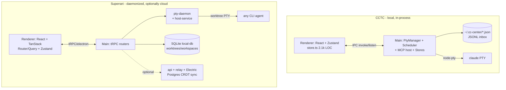

# Superset vs. CCTC — Architecture Comparison

> Analysis date: 2026-06-12. Compares this project (Claude Code Terminal Center, "CCTC")
> against [Superset](https://github.com/superset-sh/superset), an Electron desktop app
> for orchestrating CLI coding agents. Both are the same product category — a desktop
> app that runs CLI coding agents over real PTYs — but sit at very different points on
> the maturity/scope curve.

## TL;DR

| | **CCTC (ours)** | **Superset** |
|---|---|---|
| **Thesis** | Command-center for **Claude Code** sessions across projects | Orchestrate **swarms of any CLI agent** in parallel |
| **Scale** | ~118 files, ~32k LOC, single package | Monorepo: 10 apps + 22 packages, Bun + Turbo |
| **Isolation unit** | Terminal tab per project (shared cwd) | **Git worktree per task** (isolated branch + dir) |
| **Agents** | 4 Claude profiles (shell/claude/resume/yolo) | Preset system, ~11 agents (Claude, Codex, Cursor, Gemini, Droid, Copilot…) |
| **Backend** | Local-only (`~/.cc-center/*.json`) | Local SQLite **+ optional cloud** (Postgres + Electric SQL sync, relay tunnel) |
| **Terminal runtime** | In-process `PtyManager` in Electron main | **Standalone PTY daemon** w/ snapshot handoff, survives app restarts |
| **Editor** | Monaco + monaco-vscode workbench | CodeMirror + custom diff viewer (`@pierre/diffs`) |
| **Extensibility** | `@cctc/extension-sdk` (compile-time registry today) | Stainless SDK, CLI framework, plugin/skill marketplace |
| **Differentiators** | Inbox, Scheduler, Live Agent Status, Saved/Library, MCP host | Worktree mgmt, multi-agent, cloud team sync, panes/splits |

## Architecture, side by side

The deepest structural difference: **Superset decouples the terminal runtime from the
Electron app.** Their `pty-daemon` (`packages/pty-daemon`) runs as a separate process
over a Unix socket and supports *snapshot handoff* — adopting PTY file descriptors during
an app update — so terminals survive restarts with scrollback intact. Our `PtyManager`
(`src/main/pty.ts`) lives inside the Electron main process; on relaunch we re-spawn tabs
from a snapshot (`src/renderer/util/sessionRestore.ts`) but lose scrollback by design.
Their model is more robust; ours is far simpler.

## What we could learn from Superset

### 1. Git worktree isolation — the biggest conceptual gap
Their core primitive is `workspace → worktree → branch` (`packages/local-db/src/schema/schema.ts`).
Each agent task gets `git worktree add` with its own dir + branch, marked
`createdBySuperset: true`, with a `portBase` so parallel dev servers don't collide. We run
agents in the project's shared cwd, so two Claude tabs in one project step on each other.
**This is the single most valuable idea to borrow** if we ever want true *parallel* agents
rather than *managed* sessions.

### 2. Agent abstraction via presets
Their `HostAgentPreset` (`packages/shared/src/host-agent-presets.ts`) —
`{command, args, promptTransport: "argv"|"stdin", env}` — cleanly generalizes "any CLI
agent." Our `LaunchProfileId` is a hardcoded 4-value Claude union. Our own roadmap
(Personas) and the `[[personas-roadmap-parked]]` decision ("sit-beside, don't absorb")
already point this direction; their preset table is a proven shape to copy without
discarding the Claude-specific path.

### 3. tRPC over IPC
We hand-maintain `shared/ipc.ts` channel enums + a generic `modules:call` dispatch. They
use `@trpc/electron` with SuperJSON + a Sentry middleware — end-to-end typed, no manual
channel registry. For a codebase our size this is a real ergonomics win and would kill a
class of stringly-typed IPC bugs. (Caveat: their subscriptions must use RxJS observables,
not async generators — `@trpc/electron` checks `isObservable()`.)

### 4. Panes/splits as a serializable tree
Their `packages/panes` models splits as a serialize/deserialize pane tree. Ours is
`splitLayout ∈ {single, vertical, horizontal, grid}` with a fixed 3-slot array
(`src/renderer/store.ts`) — fine today, but a tree generalizes cleanly if we ever want
arbitrary nesting.

## What CCTC does that Superset doesn't (our moats)

These are genuinely **ours** — Superset has no equivalent:

- **Inbox** — agents push docs/comments to a Linear-style surface via MCP (`inbox_push`,
  `src/main/inbox-store.ts`). Superset has no agent→human async channel like this.
- **Scheduler** — in-process cron (`every 5m`, `every Mon-Fri 2pm`), run history,
  auto-close-on-finish via Stop hooks, notify-on-finish (`src/main/scheduler.ts`).
  Superset has an `Automations` SDK resource but nothing this turnkey locally.
- **Live Agent Status** — OSC-title + Notification-hook fusion to detect
  idle/working/blocked (`src/main/agent-status.ts`). Superset only tracks coarse
  running/exited/needs-attention.
- **MCP server host** + Saved Reports + Library — a whole agent-artifact lifecycle. Not
  present in Superset.
- **Deep Claude Code integration** — system-prompt injection, hook URLs, MCP config
  layering in `resolveLaunch()`. Superset is deliberately agent-agnostic and therefore
  shallower per-agent.

The two products are converging from opposite ends: **Superset = breadth** (many agents,
parallelism, cloud teams), **CCTC = depth** (rich Claude lifecycle, scheduling, async inbox).

## Things to be wary of copying

- **Their full cloud stack** (Postgres + Electric SQL + relay tunnel + Better Auth +
  Stripe) is a heavy bet on multiplayer/teams. Our local-only `~/.cc-center` JSON model is
  a deliberate simplicity advantage — don't trade it away unless we actually want team sync.
- **Bun + Turbo monorepo** makes sense at 30+ packages; at our single-package scale it'd be
  premature.
- **Their breadth costs depth** — by supporting every CLI agent, they can't do the
  Claude-specific hook/status/MCP tricks we do.

## Prioritized takeaways

Three concrete, proportionate moves if we want to act on this:

1. **Worktree-per-session** as an opt-in launch mode — unlocks safe parallel agents
   (their biggest idea).
2. **Generalize `LaunchProfileId` → a preset table** — aligns with the parked Personas
   work, low risk.
3. **Evaluate `@trpc/electron`** to replace the manual IPC registry — pure DX/correctness
   win.

## Reference: Superset structure

- **Apps** (10): `admin`, `api` (Next.js 16 + tRPC + Neon Postgres), `desktop` (Electron),
  `docs`, `electric-proxy`, `marketing`, `mobile` (Expo), `relay` (Hono WS tunnel on
  Fly.io), `streams`, `web`.
- **Packages** (22): `auth` (Better Auth + Stripe), `chat`, `cli`, `cli-framework`, `db`
  (Drizzle/Postgres), `local-db` (better-sqlite3), `host-service`, `pty-daemon`, `panes`,
  `mcp` / `mcp-v2`, `sdk` (Stainless-generated), `trpc`, `ui` (shadcn + Tailwind v4),
  `workspace-client`, `workspace-fs`, `port-scanner`, `macos-process-metrics`, etc.
- **Tooling**: Bun 1.3.11, Turborepo, Biome 2.4.2 (warnings-as-errors in CI),
  TanStack Router/Query, Electric SQL for offline-first CRDT sync.

### Notable engineering decisions in Superset
- PTY daemon mode detected via `process.argv.includes("--handoff")` (not env var) because
  electron-vite DCE strips env-var branches at build time.
- `SUPERSET_DIR_NAME` gives each worktree instance its own home dir so socket/token/pid
  don't collide across parallel instances.
- Electric SQL collections render cache-first: show cached rows while `isReady: false`,
  only show loading when there's no data.
- SDK is code-generated from an OpenAPI spec by Stainless to stay in sync with the API.
